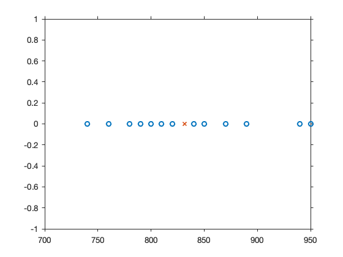
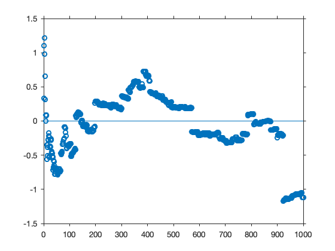
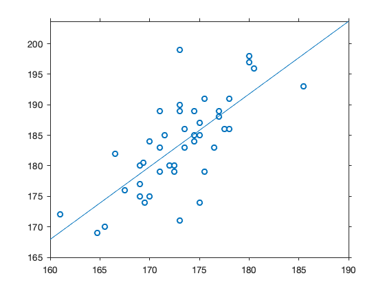
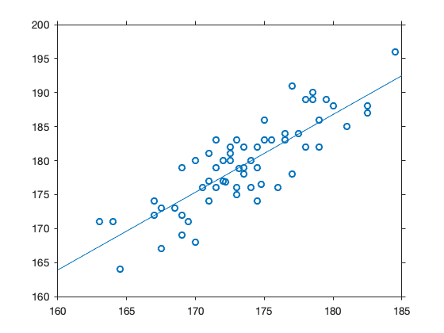

Chapter 1 Modelli Statistici
=============

Un modello statistico è una famiglia di distribuzioni di probabilità definite su un dato spazio campionario.

Esempio 1.3 Errori di misura
-----------
Velocità della luce in km/s - 299000 km/s


```matlab
x = [  890
   840
   780
   810
   760
   810
   790
   810
   820
   850
   870
   870
   810
   740
   810
   940
   950
   800
   810
   870];
```

Grafico di dispersione


```matlab
plot(x, zeros(20,1),'o')  % Figura 1.1
hold
m = mean(x);
plot(m, 0, 'x')
hold
```

    Current plot held
    Current plot released





Esempio della Cauchy
--------
Per $n = 1, 2, \dots, 1000$, calcolo $\sum_{i=1}^n x_i/n$ dove $x_1, \dots, x_n$ sono Cauchy iid. Il campione casuale è ottenuto sapendo che la Cauchy è identica alla distribuzione $t_1$ con $1$ grado di libertà.


```matlab
rng(1200)
x = trnd(1,1000,1);    
```


```matlab
m = cumsum(x)./(1:1000)';
plot(1:1000, m, 'o')  % Figura 1.2
refline(0,0)
```





Esempio 1.5 Regressione
-------
Dati sulle altezze. La prima colonna è l'altezza del figlio o figlia. La seconda e terza colonna sono l'altezza del padre e della madre. L'ultima colonna è il genere (1 = maschio, 2 = femmina).


```matlab
X = [ 170 180 164 2
175 173 165 1
171 178 176 2
167 180 168 2
180 190 167 2
169 169 169 2
169 189 168 2
183 196 173 2
174 182 163 2
173 176 176 2
163 167 168 2
199 182 164 1
186 183 173 1
178 176 167 2
179 176 176 2
175 174 175 2
176 181 164 2
170 171 168 2
176 183 170 2
180 184 169 2
176 165 170 1
193 189 182 1
168 188 172 2
168 189 170 2
171 175 171 2
188 184 170 1
169 175 171 2
184 185 164 1
189 177 177 1
173 178 169 2
185 174 169 1
177 167 171 1
186 178 169 1
190 178 168 1
162 183 160 2
174 182 167 2
170 183 163 2
174 177 167 2
164 173 164 2
182 176 157 1
159 183 160 2
171 177 165 2
170 172 166 2
187 181 169 1
184 177 163 1
174 174 168 2
171 185 177 2
183 182 165 1
162 176 165 2
172 167 155 1
169.5 179 159 2
179 179 166 1
176 182 165 2
175 186 164 2
191 187 169 1
189 179 163 1
183 179 174 1
164 174 160 2
186 188 167 1
174 178 172 1
191 184 167 1
179 182 169 1
175 172 168 1
174 168 171 1
173 182 174 2
185 183 167 1
169 179 170 2
183 172 170 1
170 191 163 2
185 177 172 1
189 181 165 1
197 180 180 1
179 182 176 2
171 183 168 2
198 186 174 1
180 177 168 1
196 187 174 1
174 168 172 2
168 183 167 2
170 177.5 153.5 1
163 179 164 2
167 181 161 2
171 176 170 2
165 171 157 2
167 176 176 2
176 179 168 2
164 180 160 2
184 184 171 2
169 164 165 2
185 176 167 2
170 183 160 2
178 186 172 2
187 180 170 1
158 171 155 2
178 189 167 2
185 188 177 2
180 176 168 1
171 181 165 1
165 173 162 2
189 180 169 1
170 180 165 2
183 187 178 2
173 176 172 2
160 172 162 2
168 176.5 173 2
167.25 178.8 167.5 2
179 180 162 1
180 172.3 165.7 1
180.5 177.4 161.3 1
169 169 160.5 1
170.75 176.9 167.5 2];
```

Altezza media dei genitori, altezza del figlio maschio, altezza della figlia femmina.


```matlab
alt_gen = (X(:,2) + X(:,3))/2;

m = X(:,4) == 1;  % indici dei maschi
f = X(:,4) == 2;  % indici delle femmine
alt_figlio = X(m, 1);
alt_figlia = X(f, 2);
```

Scatter dell'altezza dei figli maschi (in ordinata) rispetto all'altezza media dei genitori.


```matlab
figure  % Figura 1.3
plot(alt_gen(m), alt_figlio, 'o')
lsline;
```





Scatter dell'altezza delle figlie (in ordinata) rispetto all'altezza media dei genitori.


```matlab
  figure
  plot(alt_gen(f), alt_figlia, 'o')
  lsline
```





```matlab

```
