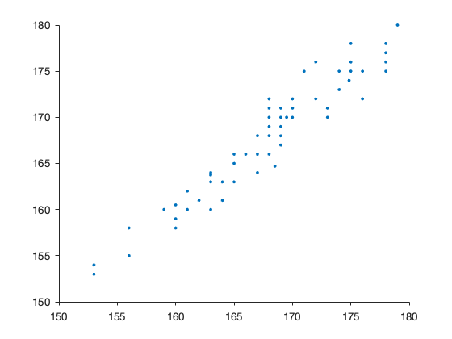

# Chapter 2

### Example 2.3 

Histograms of heights of a sample of males and females 


```matlab
% Data on adolescents (column 1),
% father (column 2), mother (column 3)
% gender (column 4, 1 = man, 2 = woman)


D = [
170 180 164 2
175 173 165 1
171 178 176 2
167 180 168 2
180 190 167 2
169 169 169 2
169 189 168 2
183 196 173 2
174 182 163 2
173 176 176 2
163 167 168 2
199 182 164 1
186 183 173 1
178 176 167 2
179 176 176 2
175 174 175 2
176 181 164 2
170 171 168 2
176 183 170 2
180 184 169 2
176 165 170 1
193 189 182 1
168 188 172 2
168 189 170 2
171 175 171 2
188 184 170 1
169 175 171 2
184 185 164 1
189 177 177 1
173 178 169 2
185 174 169 1
177 167 171 1
186 178 169 1
190 178 168 1
162 183 160 2
174 182 167 2
170 183 163 2
174 177 167 2
164 173 164 2
182 176 157 1
159 183 160 2
171 177 165 2
170 172 166 2
187 181 169 1
184 177 163 1
174 174 168 2
171 185 177 2
183 182 165 1
162 176 165 2
172 167 155 1
169.5 179 159 2
179 179 166 1
176 182 165 2
175 186 164 2
191 187 169 1
189 179 163 1
183 179 174 1
164 174 160 2
186 188 167 1
174 178 172 1
191 184 167 1
179 182 169 1
175 172 168 1
174 168 171 1
173 182 174 2
185 183 167 1
169 179 170 2
183 172 170 1
170 191 163 2
185 177 172 1
189 181 165 1
197 180 180 1
179 182 176 2
171 183 168 2
198 186 174 1
180 177 168 1
196 187 174 1
174 168 172 2
168 183 167 2
170 177.5 153.5 1
163 179 164 2
167 181 161 2
171 176 170 2
165 171 157 2
167 176 176 2
176 179 168 2
164 180 160 2
184 184 171 2
169 164 165 2
185 176 167 2
170 183 160 2
178 186 172 2
187 180 170 1
158 171 155 2
178 189 167 2
185 188 177 2
180 176 168 1
171 181 165 1
165 173 162 2
189 180 169 1
170 180 165 2
183 187 178 2
173 176 172 2
160 172 162 2
168 176.5 173 2
167.25 178.8 167.5 2
179 180 162 1
180 172.3 165.7 1
180.5 177.4 161.3 1
169 169 160.5 1
170.75 176.9 167.5 2];

size(D) 
```

    ans =
       111     4


```matlab
gender = D(:, 4);
```


```matlab
tabulate(gender)
```

      Value    Count   Percent
          1       44     39.64%
          2       67     60.36%


```matlab
male = D(gender == 1,1);
female = D(gender == 2,1);
```


```matlab
histogram(male, 'Normalization', 'pdf')
hold
fplot(@(x) normpdf(x, mean(male), std(male)), [165, 200])
hold
```

    Current plot held
    Current plot released


```matlab
histogram(female, 'Normalization', 'pdf') 
hold 
fplot(@(x) normpdf(x, mean(female), std(female)), [155, 185]) 
hold
```

    Current plot held
    Current plot released


## Box-plots


```matlab
boxplot(male)
```


```matlab

boxplot(female, 'orientation', 'horizontal')
```


## Example 2.5 Some common distributions

Comparison of three densities with the box-plot


```matlab
boxplot([exprnd(1, 20,1), normrnd(0,1, 20,1), trnd(1,20,1)  ])
```


The Cauchy density is the same of the t distribution with 1 degree of freedom. The standard normal density  has much shorter tails


```matlab
fplot(@(x) tpdf(x, 1), [-20, 20])
hold
fplot(@(x) normpdf(x, 0,1), [-20, 20])
hold
```

    Current plot held
    Current plot released


## QQ plot
Plot quantiles of the data against quantiles of the normal. Data for height of males and females.


```matlab
qqplot(male)
```


```matlab
qqplot(female)
```


## Height of twins

Data are listed below. 

The  data set contains height data for twins.

- column 1: family number
- column 2: height in cm
- column 3: gender (1=man, 2=woman)
- column 4: type of twins
    1: MZ males (identical)
    2: DZ males (fraternal)
    3: MZ females
    4: DZ females
    5: DZ mixed


```matlab
D = [1 167 2 4
1 167 2 4
2 170 2 4
2 165 2 4
3 184 1 5
3 166 2 5
4 175 1 2
4 187 1 2
5 171 2 4
5 178 2 4
6 167 2 4
6 168 2 4
7 180 2 5
7 190 1 5
8 173 2 4
8 174 2 4
9 169 2 4
9 170 2 4
10 169 2 3
10 171 2 3
11 183 2 5
11 194 1 5
12 169 2 3
12 170 2 3
13 173 2 4
13 164 2 4
14 163 2 5
14 190 1 5
15 199 1 5
15 172 2 5
16 186 1 5
16 178 2 5
17 178 2 4
17 165 2 4
18 179 2 4
18 175 2 4
19 175 2 4
19 170 2 4
20 176 2 4
20 164 2 4
21 170 2 4
21 167 2 4
22 176 2 4
22 171 2 4
23 180 2 4
23 172 2 4
24 176 1 2
24 174 1 2
25 193 1 5
25 186 2 5
26 168 2 3
26 169 2 3
27 168 2 4
27 183 2 4
28 171 2 5
28 181 1 5
29 188 1 2
29 178 1 2
30 169 2 4
30 166 2 4
31 184 1 5
31 173 2 5
32 189 1 2
32 193 1 2
33 173 2 4
33 176 2 4
34 185 1 2
34 180 1 2
35 177 1 5
35 168 2 5
36 186 1 2
36 180 1 2
37 190 1 2
37 184 1 2
38 162 2 5
38 188 1 5
39 174 2 5
39 184 1 5
40 174 2 4
40 174 2 4
41 164 2 4
41 157 2 4
42 164 2 5
42 174 1 5
43 182 1 5
43 173 2 5
44 159 2 4
44 179 2 4
45 171 2 5
45 181 1 5
46 170 2 4
46 162 2 4
47 187 1 5
47 170 2 5
48 184 1 2
48 177 1 2
49 174 2 5
49 180 1 5
50 171 2 5
50 180 1 5
51 183 1 5
51 170 2 5
52 162 2 4
52 164 2 4
53 172 1 2
53 177 1 2
54 169.5 2 3
54 170 2 3
55 179 1 2
55 190 1 2
56 173 2 4
56 185 2 4
57 176 2 4
57 165 2 4
58 175 2 4
58 168 2 4
59 191 1 2
59 197 1 2
60 183 1 5
60 166 2 5
61 170 2 4
61 174 2 4
62 164 2 4
62 156 2 4
63 186 1 2
63 190 1 2
64 174 1 5
64 161 2 5
65 191 1 2
65 186 1 2
66 185 1 5
66 171 2 5
67 179 1 5
67 176 2 5
68 175 1 5
68 171 2 5
69 174 1 2
69 182 1 2
70 173 2 5
70 193 1 5
71 168 2 5
71 182 1 5
72 185 1 1
72 180 1 1
73 169 2 5
73 182 1 5
74 183 1 2
74 183 1 2
75 178 1 5
75 176 2 5
76 170 2 5
76 186 1 5
77 185 1 2
77 180 1 2
78 189 1 2
78 188 1 2
79 168 2 5
79 179 1 5
80 197 1 5
80 180 2 5
81 179 2 4
81 180 2 4
82 194 1 5
82 169 2 5
83 182 1 1
83 181 1 1
84 171 2 3
84 175 2 3
85 176 1 1
85 173 1 1
86 172 2 3
86 176 2 3
87 165 2 3
87 165 2 3
88 179 1 1
88 177 1 1
89 173 1 1
89 175 1 1
90 164 2 3
90 163 2 3
91 180 1 1
91 170 1 1
92 174 2 3
92 173 2 3
93 169 2 3
93 170 2 3
94 183 1 1
94 183 1 1
95 171 2 5
95 186 1 5
96 165 2 3
96 165 2 3
97 178 2 5
97 180 1 5
98 182 1 5
98 173 2 5
99 175 1 1
99 175 1 1
100 166 2 3
100 166 2 3
101 191 1 1
101 185 1 1
102 198 1 5
102 174 2 5
103 173 2 3
103 170 2 3
104 189 1 1
104 185 1 1
105 198 1 1
105 194 1 1
106 179 2 3
106 180 2 3
107 175 2 3
107 175 2 3
108 170 2 4
108 168 2 4
109 170 2 3
109 172 2 3
110 161 2 3
110 160 2 3
111 173 2 3
111 171 2 3
112 166 2 3
112 166 2 3
113 177 1 1
113 180 1 1
114 170 1 1
114 171 1 1
115 198 1 1
115 195 1 1
116 180 1 5
116 175 2 5
117 172 1 1
117 174 1 1
118 196 1 2
118 186 1 2
119 163 2 3
119 163 2 3
120 185 1 1
120 186 1 1
121 195 1 1
121 193 1 1
122 175 1 1
122 174 1 1
123 174 2 5
123 181 1 5
124 180 1 1
124 179 1 1
125 197 1 1
125 196 1 1
126 178 2 3
126 175 2 3
127 167 2 3
127 164 2 3
128 178 1 1
128 185 1 1
129 180 1 1
129 178 1 1
130 179 2 3
130 180 2 3
131 181 1 1
131 182 1 1
132 170 2 3
132 172 2 3
133 178 2 3
133 178 2 3
134 160 2 3
134 159 2 3
135 163 2 3
135 160 2 3
136 182 1 1
136 187 1 1
137 168 2 3
137 170 2 3
138 190 1 1
138 185 1 1
139 167 1 1
139 166 1 1
140 167 1 1
140 167 1 1
141 160 2 3
141 160.5 2 3
142 168 2 4
142 177 2 4
143 156 2 3
143 158 2 3
144 170 1 2
144 170 1 2
145 169 2 3
145 168 2 3
146 165 2 3
146 166 2 3
147 180 1 1
147 183 1 1
148 175 2 3
148 175 2 3
149 168 2 3
149 170 2 3
150 165 2 3
150 163 2 3
151 188 1 1
151 186 1 1
152 175 1 1
152 175 1 1
153 178 1 1
153 179 1 1
154 182 1 1
154 182 1 1
155 188 1 1
155 189 1 1
156 164 2 3
156 161 2 3
157 163 2 5
157 173 1 5
158 168 2 3
158 168 2 3
159 169 2 3
159 169 2 3
160 178 2 3
160 175 2 3
161 168 2 3
161 169 2 3
162 175 2 3
162 178 2 3
163 172 2 3
163 172 2 3
164 175 2 3
164 175 2 3
165 163 2 3
165 164 2 3
166 187 1 1
166 174 1 1
167 162 2 3
167 161 2 3
168 174 2 3
168 175 2 3
169 168 2 3
169 171 2 3
170 188 1 1
170 188 1 1
171 167 2 3
171 168 2 3
172 170 2 3
172 170 2 3
173 159 2 3
173 160 2 3
174 168 2 3
174 172 2 3
175 153 2 3
175 154 2 3
176 178 2 3
176 177 2 3
177 197 1 1
177 186 1 1
178 188 1 1
178 188 1 1
179 169 2 3
179 167 2 3
180 177 1 1
180 179 1 1
181 161 2 3
181 162 2 3
182 175 2 3
182 176 2 3
183 187 1 1
183 187 1 1
184 183 1 1
184 183 1 1
185 156 2 3
185 155 2 3
186 176 2 3
186 175 2 3
187 167 2 5
187 180 1 5
188 171 2 4
188 167 2 4
189 165 2 5
189 168 1 5
190 167 2 3
190 166 2 3
191 176 2 4
191 177 2 4
192 164 2 3
192 163 2 3
193 184 2 4
193 181 2 4
194 187 1 5
194 177 2 5
195 169 2 4
195 164 2 4
196 185 2 4
196 176 2 4
197 170 2 4
197 163 2 4
198 178 2 3
198 176 2 3
199 187 1 5
199 180 2 5
200 158 2 4
200 168 2 4
201 178 2 4
201 172 2 4
202 180 1 5
202 165 2 5
203 170 2 4
203 170 2 4
204 192 1 5
204 170 2 5
205 185 2 4
205 190 2 4
206 171 1 2
206 182 1 2
207 165 2 4
207 168 2 4
208 189 1 2
208 191 1 2
209 170 2 4
209 168 2 4
210 183 2 4
210 175 2 4
211 173 2 4
211 168 2 4
212 170 2 3
212 171 2 3
213 163 2 3
213 163.75 2 3
214 176.5 1 1
214 174.5 1 1
215 191.25 1 5
215 170.5 2 5
216 176.75 2 4
216 182.5 2 4
217 180.5 1 2
217 177.5 1 2
218 161.25 2 4
218 160.75 2 4
219 160.55 2 4
219 165 2 4
220 174.85 2 3
220 174 2 3
221 170 1 5
221 155.25 2 5
222 160.5 2 4
222 175 2 4
223 174.5 1 2
223 173 1 2
224 178 1 1
224 178.75 1 1
225 153 2 3
225 153 2 3
226 160.75 2 4
226 163.25 2 4
227 183.5 1 1
227 182.4 1 1
228 160.25 2 5
228 176.25 1 5
229 183.5 1 2
229 181.5 1 2
230 173.5 2 5
230 172 1 5
231 161.5 2 5
231 171.5 1 5
232 173.75 1 2
232 188.75 1 2
233 165 2 4
233 166 2 4
234 165.25 2 5
234 177 1 5
235 178.5 1 5
235 166 2 5
236 187.5 1 1
236 190.75 1 1
237 166 2 4
237 165.5 2 4
238 161 2 4
238 162 2 4
239 177.25 1 1
239 180 1 1
240 186 1 1
240 183 1 1
241 179.5 1 5
241 168 2 5
242 177.5 1 2
242 178 1 2
243 176 1 2
243 177 1 2
244 160 2 4
244 164 2 4
245 168 2 3
245 166 2 3
246 160 2 3
246 158 2 3
247 166 2 3
247 166 2 3
248 176 2 3
248 172 2 3
249 168 2 4
249 174 2 4
250 168.5 2 3
250 164.7 2 3
251 167.25 2 4
251 168.25 2 4
252 179 1 5
252 177 2 5
253 180 1 5
253 167 2 5
254 180.5 1 2
254 176 1 2
255 169 1 2
255 176 1 2
256 170.75 2 4
256 173 2 4];
```

Analysis for identical female twins


```matlab
fem_mz = D(:,4)==3;
fem_dz = D(:,4)==4;
height = D(:,2);
xy = height(fem_mz);
U = reshape(xy, 2, length(xy)/2)';X = U(:,1); Y = U(:,2);
scatter(X,Y, '.')
r = corr(X,Y)
```

    r =
        0.9592





Analysis for fraternal female twins


```matlab
xy = height(fem_dz);
U = reshape(xy, 2, length(xy)/2)';X = U(:,1); Y = U(:,2);
scatter(X,Y, '.')
r = corr(X,Y)
```

    r =
        0.4998


## Zero correlation is not independence
Generate $(x_i, y_i)$ with a strong positive correlation, but $(x_i, y_i^2)$ are uncorrelated. Data generated as
$$
Y_i = X_i + e_i
$$
where $X_i \sim N(0,1)$ and $e_i \sim N(0, 1/5)$.


```matlab
rng(1023)
x = randn(100,1); % standard normal
y = x + randn(100,1)/5;
scatter(x,y, '.')
r = corr(x,y)
```

    r =
        0.9868


```matlab
scatter(x,y.^2, '.')
r2 = corr(x,y.^2)
```

    r2 =
        0.0881


## Autocorrelation
Data for the application: Black-Scholes model log returns of HP shares in the period 1984-1991.


```matlab
x = [
0.003125000000
-0.034267910000
-0.019354840000
0.036184210000
-0.022222220000
-0.006493506000
0.013071900000
-0.025806450000
0.019867550000
-0.006493506000
-0.045751630000
-0.023972600000
-0.003508772000
0.003521127000
0.003508772000
0.062937070000
-0.023026320000
-0.033670030000
-0.013937280000
0.042402830000
-0.006779661000
-0.010238910000
-0.031034480000
-0.017793590000
0.000000000000
-0.010869570000
0.054945060000
0.034722220000
-0.006711409000
0.004594595000
0.030303030000
-0.032679740000
0.010135130000
-0.013377930000
-0.030508480000
-0.013986010000
-0.021276600000
0.007246377000
0.061151080000
-0.020338980000
0.020761250000
-0.027118640000
-0.013937280000
-0.049469970000
-0.059479550000
0.059288540000
-0.007462686000
0.000000000000
0.000000000000
0.048872180000
0.014336920000
-0.014134280000
-0.007168459000
-0.007220217000
0.018181820000
-0.007142857000
0.010791370000
-0.003558719000
0.032142860000
0.003460208000
0.020689660000
0.000000000000
-0.033783780000
-0.017482520000
-0.042704630000
0.026022310000
0.010869570000
0.000000000000
-0.007168459000
-0.007220217000
0.014545450000
0.003584229000
0.021428570000
-0.010489510000
-0.014134280000
0.003584229000
-0.014285710000
-0.025362320000
-0.018587360000
0.003787879000
0.000000000000
0.030188680000
0.025641030000
0.017857140000
0.000000000000
-0.007017544000
-0.007067138000
0.014234880000
0.010526320000
-0.017361110000
-0.021201410000
0.003610108000
-0.016690650000
-0.014652010000
0.055762080000
0.000000000000
0.042253520000
-0.016891890000
-0.003436426000
0.010344830000
0.006825938000
0.000000000000
-0.010169490000
0.000000000000
0.006849315000
0.006802721000
0.010135130000
-0.036789300000
0.013888890000
-0.010273970000
0.000000000000
-0.006920415000
-0.045296170000
0.000000000000
0.036496350000
-0.014084510000
-0.007142857000
-0.014388490000
0.018248170000
0.000000000000
0.000000000000
0.028673840000
0.013937280000
-0.013745700000
0.017421600000
0.037671230000
0.042904290000
0.031645570000
0.000000000000
0.024539880000
-0.011976050000
0.039393940000
-0.002915452000
0.000000000000
-0.032163740000
0.003021148000
-0.045180720000
0.009463723000
0.000000000000
0.015625000000
-0.015384620000
0.028125000000
-0.015197570000
-0.015432100000
0.006269592000
0.012461060000
-0.021538460000
-0.012578620000
0.000000000000
-0.015923570000
-0.006472492000
-0.019543970000
0.003322259000
0.023178810000
-0.025889970000
0.028039870000
0.012944980000
0.000000000000
-0.031948880000
0.006600660000
-0.006557377000
-0.029702970000
0.006802721000
0.006756757000
0.023489930000
-0.003278689000
-0.016447370000
-0.010033440000
-0.016891890000
-0.017182130000
0.003496503000
-0.010452960000
-0.017605630000
0.003584229000
0.032142860000
0.010380620000
-0.013698630000
0.031250000000
-0.006734007000
-0.006779661000
0.058020480000
-0.012903230000
-0.003267974000
0.016393440000
0.012903230000
-0.047770700000
-0.033444810000
-0.017301040000
0.031690140000
-0.010238910000
0.017241380000
-0.006779661000
0.010238910000
0.027027030000
-0.019736840000
-0.046979870000
-0.031690140000
-0.010909090000
0.007352941000
-0.007299270000
-0.007352941000
-0.014814810000
-0.033834590000
0.003891051000
0.011627910000
0.026819920000
0.003731343000
0.018587360000
-0.029197080000
-0.007518797000
-0.003787879000
-0.011406840000
0.011538460000
-0.003802281000
0.015267180000
0.007518797000
0.003731343000
0.003717472000
-0.007407407000
-0.035671640000
0.011627910000
0.007662835000
0.041825090000
0.021897810000
-0.017857140000
-0.007272727000
0.018315020000
-0.003597122000
-0.010830330000
-0.007299270000
-0.003676471000
0.000000000000
0.000000000000
-0.007380074000
0.003717472000
0.014814810000
0.010948900000
0.054151620000
-0.017123290000
0.024390240000
0.010204080000
0.000000000000
-0.037037040000
-0.006993007000
0.024647890000
-0.034364260000
-0.035587190000
0.022140220000
0.032490980000
0.013986010000
0.020689660000
0.023648650000
-0.009900990000
-0.016666670000
0.030508480000
-0.006578947000
-0.003311258000
0.019933560000
0.003257329000
-0.022727270000
-0.029900330000
0.000000000000
0.020547950000
-0.020134230000
-0.010273970000
0.041522490000
0.003322259000
-0.019867550000
0.037162160000
-0.016286650000
-0.029801320000
0.010238910000
0.020270270000
-0.019867550000
0.006756757000
-0.013422820000
-0.020408160000
-0.017361110000
0.014134280000
-0.017421600000
-0.046099290000
0.001635688000
0.000000000000
-0.003717472000
0.007462686000
-0.007407407000
-0.003731343000
-0.011235960000
-0.003787879000
0.026615970000
0.014814810000
-0.007299270000
0.000000000000
0.011029410000
0.007272727000
-0.032490980000
0.011194030000
-0.018450180000
-0.003759399000
0.003773585000
0.022556390000
0.011029410000
0.010909090000
0.007194245000
-0.007142857000
-0.014388490000
0.003649635000
-0.029090910000
0.014981270000
0.003690037000
-0.014705880000
-0.014925370000
-0.026515150000
-0.011673150000
0.000000000000
0.015748030000
0.003875969000
0.003861004000
0.007692308000
-0.003816794000
0.000000000000
0.042145590000
0.018382350000
-0.018050540000
0.000000000000
-0.033088240000
0.038022810000
0.054945060000
-0.048611110000
-0.029197080000
-0.037593980000
0.031250000000
0.026515150000
-0.007380074000
-0.014869890000
0.003773585000
0.018796990000
0.007380074000
-0.040293040000
0.003816794000
0.007604563000
0.026415090000
0.000000000000
-0.003676471000
-0.035276750000
0.019157090000
-0.037593980000
0.007812500000
0.007751938000
0.003846154000
0.045977010000
0.014652010000
0.010830330000
0.000000000000
-0.003571429000
0.003584229000
0.025000000000
-0.006968641000
0.003508772000
0.010489510000
-0.010380620000
-0.017482520000
0.010676160000
0.014084510000
-0.006944444000
0.000000000000
0.031468530000
0.020338980000
-0.029900330000
0.017123290000
0.020202020000
-0.006600660000
-0.013289040000
0.020202020000
-0.006600660000
-0.009966778000
0.003355705000
0.013377930000
0.013201320000
0.000000000000
-0.022801300000
-0.020000000000
0.000000000000
-0.013605440000
0.006896552000
-0.013698630000
0.006944444000
0.010344830000
-0.013651880000
-0.013840830000
-0.007017544000
0.003533569000
0.014084510000
0.000000000000
-0.006944444000
0.017482520000
0.003436426000
0.000000000000
-0.006849315000
-0.020689660000
0.000000000000
-0.017605630000
-0.025089610000
0.011029410000
0.007272727000
-0.010830330000
-0.014598540000
-0.016888890000
-0.007547170000
-0.003802281000
0.011450380000
0.011320750000
-0.003731343000
-0.029962550000
0.007722008000
-0.022988510000
0.003921569000
0.011718750000
0.003861004000
0.015384620000
-0.015151520000
-0.003846154000
-0.011583010000
-0.031250000000
-0.040322580000
0.000000000000
-0.016806720000
0.025641030000
0.033333340000
-0.016129030000
-0.012295080000
-0.008298756000
-0.020920500000
0.012820510000
0.025316460000
0.032921810000
0.007968128000
-0.027667980000
-0.012195120000
0.004115226000
-0.008196721000
0.000000000000
-0.008264462000
0.004166667000
0.029045640000
0.040322580000
0.000000000000
-0.007751938000
0.011718750000
0.019305020000
-0.007575758000
0.019083970000
-0.014981270000
0.011406840000
0.052631580000
-0.021428570000
0.021897810000
0.003571429000
-0.024911030000
0.003649635000
0.032727270000
0.010563380000
-0.010452960000
-0.003521127000
0.031802120000
-0.006849315000
-0.006896552000
0.024305560000
0.016949150000
0.003333333000
0.001461794000
0.009966778000
0.003289474000
-0.052459020000
0.010380620000
0.003424658000
-0.006825938000
-0.003436426000
-0.013793100000
0.010489510000
0.010380620000
0.017123290000
-0.010101010000
-0.006802721000
0.010273970000
0.003389830000
0.027027030000
-0.026315790000
-0.013513510000
-0.010273970000
0.017301040000
0.006802721000
0.037162160000
0.029315960000
-0.003164557000
0.003174603000
0.025316460000
-0.027777780000
-0.025396830000
0.006514658000
0.029126210000
-0.012578620000
0.006369427000
-0.018987340000
0.016129030000
0.015873020000
0.000000000000
0.012500000000
0.018518520000
0.021212120000
0.026706230000
0.005780347000
-0.011494250000
0.000000000000
0.002906977000
0.031884060000
-0.025280900000
0.005763689000
0.008595988000
-0.019886360000
-0.026086960000
-0.005952381000
0.038922160000
0.011527380000
-0.019943020000
-0.011627910000
-0.029411760000
0.009090909000
0.009009009000
-0.002976191000
0.035820890000
0.025936600000
-0.021235960000
0.017241380000
-0.005649718000
0.002840909000
-0.022662890000
-0.002898551000
-0.023255810000
0.000000000000
-0.005952381000
0.032934130000
0.011594200000
0.008595988000
-0.036931820000
0.002949852000
0.000000000000
-0.052941180000
0.040372670000
0.011940300000
-0.014749260000
0.008982036000
-0.026706230000
0.018292680000
0.008982036000
0.008902078000
-0.017647060000
0.017964070000
0.044117650000
0.008450705000
0.013966480000
0.038567490000
0.007957560000
0.007894737000
-0.033942560000
-0.021621620000
-0.038674030000
0.008620690000
0.028490030000
-0.022160660000
0.022662890000
0.002770083000
0.000000000000
-0.016574590000
-0.011235960000
0.005681818000
-0.025423730000
0.002898551000
0.014450870000
0.008547009000
-0.022598870000
0.026011560000
0.000000000000
0.036619720000
0.002717391000
0.016260160000
-0.013333330000
-0.029729730000
0.000000000000
-0.022284120000
-0.014245010000
-0.005780347000
-0.023255810000
0.017857140000
0.000000000000
-0.010409360000
0.020710060000
0.008695652000
-0.040229890000
0.002994012000
-0.005970149000
0.033033030000
-0.011627910000
0.005882353000
-0.011695910000
-0.005917160000
-0.011904760000
-0.012048190000
-0.009146341000
0.040000000000
-0.011834320000
-0.017964070000
0.012195120000
-0.003012048000
0.000000000000
-0.030211480000
-0.049844240000
-0.055737700000
0.010416670000
0.030927840000
0.010000000000
0.023102310000
0.003225806000
-0.003215434000
0.006451613000
0.000000000000
-0.016025640000
-0.022801300000
0.046666670000
0.003184713000
-0.038095240000
0.019801980000
0.012944980000
0.019169330000
-0.009404388000
-0.006329114000
0.022292990000
0.024922120000
0.024316110000
-0.002967359000
-0.023809520000
-0.018292680000
0.046583850000
0.020771510000
0.002906977000
0.011594200000
-0.025787970000
0.035294120000
0.011363640000
0.011235960000
0.033333340000
-0.010752690000
0.005434783000
0.040540540000
-0.005194805000
0.026109660000
-0.040712470000
0.007957560000
-0.042105260000
-0.019230770000
0.002801121000
0.000000000000
0.022346370000
-0.001530055000
-0.005479452000
-0.013774100000
-0.013966480000
-0.014164310000
-0.089080460000
-0.044164040000
-0.019801980000
0.037037040000
0.009740259000
-0.009646302000
-0.003246753000
0.013029320000
-0.028938910000
0.013245030000
-0.026143790000
0.013422820000
0.016556290000
0.003257329000
0.000000000000
-0.009740259000
-0.013114750000
-0.009966778000
0.013422820000
-0.006622517000
0.040000000000
-0.009615385000
0.012944980000
-0.009584664000
0.012903230000
0.003184713000
-0.009523810000
0.028846150000
0.028037380000
0.018181820000
-0.017857140000
0.000000000000
0.006060606000
-0.003012048000
-0.006042296000
-0.009118541000
0.021472390000
0.015015020000
-0.023668640000
-0.015151520000
0.027692310000
0.029940120000
0.026162790000
0.008498584000
0.000000000000
-0.022471910000
0.022988510000
0.022471910000
-0.021978020000
-0.008426966000
-0.011331440000
0.011461320000
-0.016997170000
0.011527380000
-0.008547009000
-0.022988510000
0.023529410000
0.005747126000
-0.001600000000
-0.011461320000
0.014492750000
-0.008571428000
0.002881844000
-0.005747126000
-0.005780347000
-0.002906977000
-0.017492710000
-0.005934718000
0.011940300000
0.020648970000
-0.002890173000
0.026086960000
0.019774010000
0.027700830000
0.029649590000
-0.015706810000
0.042553190000
-0.002551020000
0.023017900000
0.080000000000
-0.041666670000
0.012077290000
0.019093080000
-0.070257610000
-0.015113350000
0.002557545000
0.038265310000
0.000000000000
-0.014742010000
0.022443890000
0.017073170000
0.021582730000
0.016431920000
-0.006928407000
-0.009302326000
-0.018779340000
0.016746410000
0.007058823000
0.051401870000
0.044444450000
-0.034042550000
-0.059471370000
-0.030444960000
0.012077290000
0.004773270000
0.028503560000
0.016166280000
-0.002272727000
-0.015945330000
-0.011574070000
0.035128810000
0.004524887000
-0.022522520000
0.016129030000
0.006802721000
-0.020270270000
0.018390800000
0.036117380000
-0.010893250000
0.046255510000
-0.016842100000
0.033062100000
0.016597510000
-0.010204080000
-0.028865980000
-0.004246285000
-0.006396588000
-0.017167380000
-0.017467250000
0.011111110000
0.002197802000
-0.019736840000
0.046979870000
-0.010683760000
-0.021598270000
-0.011037530000
-0.022321430000
0.002283105000
-0.034168560000
0.002358491000
0.007058823000
0.023364490000
0.009132420000
0.040723980000
-0.045652170000
-0.015945330000
-0.018518520000
0.030660380000
0.036613270000
0.002207506000
-0.013215860000
0.013392860000
0.030837010000
0.059829060000
-0.030241930000
0.004158004000
0.016563150000
-0.026476580000
0.029288700000
0.028455290000
0.015810280000
-0.027237350000
0.022000000000
-0.023483370000
-0.006012024000
0.006048387000
0.010020040000
0.021825400000
-0.001941748000
0.005836576000
0.007736944000
0.015355090000
-0.032136110000
-0.029296880000
0.014084510000
-0.003968254000
0.009960160000
-0.005917160000
-0.007936508000
0.004000000000
0.011952190000
-0.017716540000
0.012024050000
-0.003960396000
-0.015029820000
0.006060606000
0.012048190000
-0.019841270000
-0.002024292000
0.024340770000
-0.007920792000
-0.005988024000
-0.018072290000
-0.016359920000
0.014553010000
0.010245900000
-0.018255580000
0.000000000000
0.000000000000
0.010330580000
0.012269940000
0.014141410000
-0.001992032000
0.005988024000
0.000000000000
-0.019841270000
-0.020242910000
-0.010330580000
-0.010438410000
0.012658230000
0.004166667000
0.024896270000
0.004048583000
-0.002016129000
-0.012121210000
-0.012269940000
0.010351970000
0.020491800000
0.044176710000
0.019230770000
0.018867920000
0.005555556000
-0.003683241000
0.020332720000
-0.007246377000
-0.003649635000
-0.010989010000
-0.037037040000
0.025000000000
0.026266420000
-0.007312614000
0.005524862000
-0.016483520000
-0.020484170000
-0.028517110000
0.037182000000
-0.049056600000
0.033730160000
-0.007677543000
-0.017408120000
-0.011811020000
0.019920320000
0.021484380000
0.011472280000
-0.007561437000
-0.020952380000
-0.007782101000
0.002980392000
0.005870841000
0.019455250000
0.040076330000
0.027522940000
-0.008928572000
-0.003603604000
0.005424955000
0.001798561000
0.012567320000
0.028368790000
0.001724138000
0.012048190000
-0.042517010000
-0.008880994000
-0.032258060000
-0.014814810000
0.001879699000
0.016885550000
-0.027675280000
-0.034155600000
-0.060903730000
-0.202928900000
0.028871390000
0.010204080000
-0.083333340000
-0.008264462000
-0.127777800000
0.066878980000
0.074626860000
0.066666670000
0.044270830000
0.012468830000
-0.029556650000
-0.025380710000
0.049479170000
0.002481390000
-0.029702970000
-0.030612250000
0.013157890000
0.075324680000
-0.016908210000
-0.002457002000
-0.004926108000
0.024752480000
-0.041062800000
0.010075570000
0.019950130000
0.017114910000
-0.028846150000
-0.024752480000
-0.073604060000
0.035616440000
0.007936508000
-0.044619420000
0.005494506000
0.043715850000
0.075916230000
0.026763990000
-0.018957350000
0.002415459000
0.048192770000
0.025287360000
0.026905830000
-0.029432310000
0.022522520000
0.013215860000
-0.013043480000
0.013215860000
0.015217390000
-0.029978590000
0.008830022000
0.028446390000
-0.008510638000
0.030042920000
-0.010416670000
0.004210526000
0.010482180000
-0.095435690000
0.025229360000
-0.022371360000
-0.002288329000
0.004587156000
0.041095890000
-0.019736840000
-0.013422820000
-0.049886620000
0.007159905000
0.007109005000
0.047058820000
-0.015730340000
0.006849315000
0.020408160000
0.008888889000
-0.011013220000
-0.024498890000
-0.029680370000
-0.004705882000
0.000000000000
0.014184400000
0.030303030000
0.036199100000
0.000000000000
-0.002183406000
0.026258210000
-0.019189770000
0.034782610000
0.021008400000
0.008230452000
-0.002040816000
-0.010224950000
-0.008264462000
0.016666670000
0.010245900000
0.000000000000
0.048681540000
-0.011605420000
-0.005870841000
-0.007874016000
-0.003968254000
0.027888450000
-0.038759690000
0.004032258000
0.022088350000
0.005893910000
0.015625000000
-0.014384620000
-0.033203130000
0.022222220000
-0.001976285000
-0.009900990000
-0.028000000000
-0.016460900000
0.002092050000
0.014613780000
0.004115226000
-0.004098360000
0.020576130000
0.008064516000
0.030000000000
-0.027184470000
0.021956090000
0.005859375000
-0.011650480000
0.013752460000
-0.054263570000
0.018442620000
-0.008048289000
-0.022312370000
0.022821580000
-0.010141990000
0.014344260000
0.010101010000
0.000000000000
0.002000000000
-0.017964070000
-0.006097561000
0.006134969000
0.018292680000
-0.013972060000
-0.006072875000
-0.006109979000
0.008196721000
0.008130081000
-0.020161290000
0.008230452000
0.020408160000
0.016000000000
-0.017716540000
-0.086172340000
-0.008771930000
0.015486730000
-0.019607840000
-0.006666667000
0.002237136000
-0.029017860000
-0.006896552000
0.043981480000
0.028824830000
-0.021551720000
-0.008810572000
0.011111110000
0.013186810000
0.017353580000
-0.004264392000
-0.014989290000
0.015217390000
-0.051391860000
-0.036117380000
-0.008149883000
0.002364066000
0.014150940000
0.013953490000
-0.048165140000
0.019277110000
0.004728132000
-0.009411764000
0.016627080000
0.023364490000
0.018264840000
-0.013452910000
0.009090909000
-0.029279280000
0.027842230000
-0.009029346000
-0.020501140000
-0.011627910000
-0.002352941000
-0.004716981000
0.007109005000
0.002352941000
-0.014084510000
0.002380952000
-0.035629460000
-0.022167490000
0.012594460000
-0.009950249000
-0.027638190000
0.010335920000
0.033248080000
0.012376240000
0.000000000000
-0.017114910000
-0.014925370000
-0.005050505000
0.000000000000
0.012690360000
-0.022556390000
0.010256410000
0.000000000000
-0.038071070000
-0.031662270000
-0.035422340000
0.016949150000
0.000000000000
-0.011111110000
0.005617978000
0.022346370000
-0.010928960000
0.024861880000
0.018867920000
0.013227510000
-0.028720630000
-0.013440860000
0.029972750000
0.005291005000
-0.007894737000
0.007957560000
0.028947370000
0.002557545000
-0.017857140000
0.007792208000
-0.010309280000
0.025208330000
-0.015267180000
0.002583979000
0.010309280000
-0.010204080000
0.018041240000
-0.002531646000
-0.002538071000
-0.002544529000
0.025510200000
-0.007462686000
-0.002506266000
-0.010050250000
-0.010152280000
0.010256410000
0.012690360000
0.002506266000
0.010000000000
-0.024752480000
0.000000000000
0.002538071000
0.015189870000
0.019950130000
-0.041564790000
0.056122450000
0.000000000000
-0.009661836000
-0.012195120000
-0.009876544000
-0.004987531000
-0.010025060000
0.022784810000
-0.014851490000
0.000000000000
-0.025125630000
-0.007731959000
-0.005194805000
0.020887730000
-0.023017900000
0.005235602000
-0.031250000000
0.021505380000
-0.002631579000
-0.031662270000
0.019073570000
0.029411760000
-0.018181820000
-0.005291005000
0.010638300000
-0.013157890000
0.021333330000
0.020887730000
-0.010230180000
0.012919900000
0.025510200000
0.024875620000
-0.002427184000
0.002433090000
-0.036407770000
0.000000000000
0.007556675000
0.020000000000
0.000000000000
-0.000784314000
0.000000000000
0.012285010000
0.029126210000
0.014150940000
-0.011627910000
0.002352941000
-0.009389671000
0.007109005000
0.004705882000
-0.002341920000
-0.018779340000
0.031100480000
-0.009280742000
-0.011709600000
-0.002369668000
0.000000000000
0.000000000000
0.002375297000
-0.011848340000
0.007194245000
-0.007142857000
0.019184650000
0.028235290000
0.004576659000
-0.002277904000
0.027397260000
-0.008888889000
0.022421520000
-0.008771930000
0.013274340000
0.008733625000
-0.002164502000
-0.004338395000
0.013071900000
-0.008602151000
0.041214750000
0.025000000000
-0.040650400000
-0.025423730000
0.010869570000
-0.015053760000
0.015283840000
0.012903230000
0.019108280000
-0.016666670000
-0.044491530000
-0.008869180000
-0.029082770000
0.013824880000
0.004545454000
-0.009049774000
0.002283105000
0.020501140000
-0.006696429000
0.004494382000
-0.006711409000
-0.033783780000
0.004662005000
0.025522040000
-0.011312220000
-0.006864989000
0.031520740000
-0.035794180000
-0.011600930000
0.009389671000
-0.032558140000
-0.007211538000
-0.002421308000
-0.004854369000
-0.009756098000
-0.007389163000
0.019851120000
-0.004866180000
0.007334963000
0.016990290000
-0.011933170000
0.028985510000
0.004694836000
0.014018690000
-0.013824880000
0.000000000000
0.039719630000
-0.004494382000
0.024830700000
0.002202643000
-0.006593407000
0.015486730000
-0.006535948000
-0.019736840000
0.002237136000
-0.002232143000
0.015659950000
-0.006607930000
-0.019955650000
0.011312220000
-0.002237136000
-0.013452910000
-0.022727270000
0.004651163000
0.016203700000
-0.004555809000
0.045766590000
-0.065645520000
-0.002341920000
0.014084510000
0.011574070000
0.016018310000
-0.004504505000
-0.027149320000
-0.002325581000
0.004662005000
0.004640371000
0.000000000000
-0.002309469000
-0.002314815000
0.013921110000
0.000000000000
0.006864989000
-0.011363640000
-0.002298851000
0.000000000000
0.004608295000
-0.013761470000
-0.021674420000
-0.014285710000
0.016908210000
0.014251780000
-0.018735360000
-0.007159905000
-0.009615385000
0.031553400000
-0.007058823000
0.014218010000
-0.007009346000
-0.028235290000
0.002421308000
0.004830918000
-0.009615385000
0.002427184000
0.029055690000
0.007058823000
-0.002336449000
0.002341920000
0.000000000000
-0.002336449000
0.000000000000
-0.007025761000
0.018867920000
-0.013888890000
-0.004694836000
-0.007075472000
-0.021377670000
0.012135920000
0.002398082000
0.023923450000
0.004672897000
-0.011627910000
-0.007058823000
-0.011848340000
0.043165470000
0.057471260000
-0.008695652000
-0.008771930000
-0.013274340000
-0.008968610000
-0.045248870000
-0.004739337000
0.000000000000
-0.028571430000
0.007352941000
-0.017031630000
0.000000000000
-0.002475247000
0.034739450000
-0.007194245000
0.004830918000
-0.016826920000
0.019559900000
0.007194245000
0.011904760000
-0.025882350000
-0.007246377000
0.002433090000
0.000000000000
0.004854369000
0.002415459000
-0.019277110000
0.002063882000
0.012285010000
0.007281553000
-0.012048190000
0.004878049000
0.000000000000
-0.004854369000
-0.002439024000
-0.004889976000
0.007371007000
-0.017073170000
-0.002481390000
-0.019900500000
-0.020304570000
0.015544040000
0.020408160000
0.002500000000
0.022443890000
0.000000000000
0.000000000000
0.000000000000
-0.060975610000
0.012987010000
0.000000000000
0.005128205000
0.025510200000
-0.004975124000
-0.012500000000
0.037974680000
-0.014634150000
-0.014851490000
-0.007537689000
-0.048101260000
0.015957450000
-0.026178010000
-0.043010750000
-0.016853930000
-0.034285710000
0.029585800000
-0.025862070000
0.011799410000
0.002915452000
0.000000000000
-0.023255810000
-0.020833330000
0.003039514000
0.078787880000
-0.002808989000
0.000000000000
0.000000000000
0.000000000000
0.005633803000
-0.022408960000
0.014326650000
0.025423730000
0.016528920000
0.027100270000
-0.023746700000
-0.008108108000
0.016348770000
-0.002680965000
-0.016129030000
0.000000000000
-0.008196721000
-0.016969700000
0.005617978000
-0.005586592000
0.022471910000
0.008241759000
-0.010899180000
0.005509642000
0.005479452000
0.002724796000
0.005434783000
0.021621620000
0.044973540000
-0.017721520000
-0.010309280000
-0.013020830000
0.018469660000
-0.023316060000
-0.002652520000
-0.002659574000
-0.024000000000
-0.008196721000
0.027548210000
-0.018766760000
-0.008196721000
-0.016528920000
-0.002801121000
0.002808989000
0.002801121000
-0.019553070000
0.005698006000
-0.011331440000
0.014326650000
0.008474576000
-0.005602241000
0.005633803000
0.016806720000
-0.002754821000
0.052486190000
-0.002624672000
-0.018421050000
-0.018766760000
0.013661200000
0.008086253000
0.010695190000
-0.071428570000
-0.037037040000
-0.002958580000
-0.017804160000
0.003021148000
0.018072290000
0.002958580000
0.017699110000
-0.026086960000
0.011904760000
-0.002941177000
0.002949852000
0.026470590000
0.025787970000
-0.002793296000
0.000000000000
-0.008403362000
-0.005649718000
0.002386363000
0.025568180000
0.055401660000
-0.015748030000
-0.008000000000
0.002688172000
-0.002680965000
-0.005376344000
0.008108108000
0.000000000000
0.002680965000
-0.021390370000
0.010928960000
0.010810810000
-0.024064170000
-0.016438360000
-0.025069640000
0.000000000000
0.031428570000
-0.008310249000
-0.002793296000
0.005602241000
-0.005571031000
-0.025210080000
-0.002873563000
0.000000000000
-0.011527380000
-0.008746356000
0.023529410000
0.008620690000
-0.019943020000
0.014534880000
0.005730659000
0.011396010000
-0.008450705000
0.017045460000
-0.005586592000
0.000000000000
0.008426966000
0.030640670000
0.018918920000
0.026525200000
-0.007751938000
-0.039062500000
-0.016260160000
-0.002754821000
0.011049720000
0.010928960000
0.024324320000
0.010554090000
-0.013054830000
0.013227510000
0.002610966000
-0.005208333000
0.000000000000
0.020942410000
0.017948720000
-0.015113350000
0.015345270000
-0.007556675000
-0.017766500000
0.000000000000
-0.002583979000
-0.005595855000
-0.007832898000
-0.018421050000
0.021447720000
0.013123360000
-0.010362690000
-0.018324610000
-0.010666670000
0.002695418000
-0.005376344000
0.024324320000
-0.002638523000
0.010582010000
0.002617801000
-0.015665800000
0.005305040000
0.007915568000
-0.013089000000
0.002652520000
0.015873020000
-0.013020830000
0.007915568000
0.002617801000
-0.007832898000
-0.005263158000
-0.039682540000
-0.019283750000
-0.005617978000
0.019774010000
-0.008310249000
-0.013966480000
-0.014164310000
-0.008620690000
-0.017391300000
-0.002949852000
-0.041420120000
-0.033950620000
0.006389776000
-0.022222220000
-0.038961040000
0.020270270000
0.013245030000
-0.032679740000
0.020270270000
-0.049668870000
-0.034843210000
-0.007220217000
-0.032727270000
-0.015037590000
0.011450380000
0.033962260000
0.065693430000
-0.013698630000
0.013888890000
-0.034246580000
-0.010638300000
0.017921150000
-0.031690140000
0.018181820000
0.007142857000
-0.017730500000
0.003610108000
0.010791370000
-0.021352310000
-0.036363640000
-0.011320750000
0.015267180000
0.007518797000
-0.041641790000
-0.003906250000
-0.043137260000
0.032786880000
-0.031746030000
-0.020491800000
0.121338900000
-0.059701490000
-0.007936508000
-0.008000000000
-0.056451610000
0.017094020000
0.012605040000
-0.029045640000
-0.034188040000
-0.039823010000
-0.009216590000
0.037209300000
0.008968610000
-0.013333330000
0.054054060000
0.004273504000
0.000000000000
0.000000000000
0.000000000000
-0.017021280000
-0.025974030000
-0.040000000000
-0.013888890000
-0.023474180000
0.048076920000
0.004587156000
0.022831050000
-0.075892860000
-0.028985510000
0.064676620000
0.004672897000
0.055813950000
-0.061674010000
0.061032870000
-0.044247790000
0.050925930000
0.017621140000
-0.030303030000
0.013392860000
-0.017621140000
0.000000000000
0.022421520000
0.017543860000
-0.004310345000
0.038961040000
0.025000000000
0.020325200000
0.063745020000
-0.018726590000
0.007633588000
0.000000000000
-0.034090910000
0.035294120000
-0.022727270000
-0.007751938000
-0.011718750000
0.015810280000
0.007159533000
-0.023255810000
0.011904760000
0.003921569000
0.000000000000
-0.007812500000
0.007874016000
-0.003906250000
-0.003921569000
0.000000000000
-0.015748030000
0.008000000000
0.003968254000
-0.027667980000
-0.012195120000
0.012345680000
0.000000000000
0.016260160000
0.072000000000
0.059701490000
0.070422540000
-0.036184210000
-0.047781570000
0.025089610000
0.020979020000
0.010273970000
0.023728810000
0.009933775000
0.022950820000
-0.003205128000
-0.025723470000
-0.003300330000
-0.006622517000
0.016666670000
0.003278689000
0.009803922000
0.061488670000
-0.021341460000
0.021806850000
-0.018292680000
-0.003105590000
0.137071700000
0.019178080000
0.016129030000
0.002645503000
0.002638523000
-0.021052630000
0.000000000000
0.002688172000
0.024128690000
-0.005235602000
0.034210530000
0.022900760000
-0.009950249000
-0.017587940000
0.007672634000
-0.022842640000
0.025974030000
-0.015189870000
-0.025773200000
0.002645503000
-0.036939320000
0.000000000000
-0.005479452000
0.041322310000
0.007936508000
0.034120730000
0.030456850000
-0.014778330000
-0.022500000000
0.028132990000
0.004975124000
0.029702970000
-0.038461540000
0.027500000000
-0.026763990000
0.015000000000
0.000000000000
0.017241380000
-0.007263923000
0.036585360000
0.002352941000
0.002347418000
-0.007025761000
-0.007075472000
0.009501188000
0.035294120000
-0.025000000000
-0.006993007000
-0.035211270000
-0.004866180000
-0.034229830000
-0.030379750000
-0.033942560000
0.000000000000
-0.024324320000
0.030470910000
0.053763440000
-0.015306120000
0.010362690000
-0.020512820000
-0.036649220000
0.043478260000
0.002604167000
-0.002597403000
0.000000000000
0.031250000000
0.027777780000
0.002457002000
0.036764710000
0.009456265000
0.002341920000
0.014018690000
-0.002304147000
-0.004618938000
0.002320186000
-0.020833330000
-0.028368790000
0.012165450000
0.004807692000
0.016746410000
-0.018823530000
-0.009615385000
-0.007281553000
-0.004889976000
0.000000000000
-0.004914005000
0.017283950000
-0.024271840000
0.014925370000
0.009803922000
0.002427184000
-0.016949150000
0.036945810000
-0.004750594000
-0.028639620000
-0.002457002000
0.046798030000
0.016470590000
0.013888890000
-0.022831050000
0.004672897000
0.046511630000
-0.008888889000
0.002242153000
0.000000000000
0.002237136000
-0.020089290000
-0.025056950000
-0.011682240000
0.011820330000
0.007009346000
0.011600930000
0.004587156000
-0.018264840000
0.020930230000
0.029612760000
-0.026548670000
0.006818182000
-0.018058690000
-0.022988510000
0.007058823000
-0.009345794000
0.002358491000
0.035294120000
-0.009090909000
-0.064220180000
-0.019607840000
-0.002500000000
0.035087720000
0.009685230000
0.026378900000
0.004672897000
-0.011627910000
-0.002352941000
0.014150940000
-0.016279070000
-0.016548460000
-0.021634620000
-0.022113020000
0.017587940000
0.002469136000
-0.029556650000
-0.025380710000
0.028645830000
-0.040506330000
-0.023746700000
0.008108108000
0.013404830000
0.015873010000
0.010443860000
0.005167959000
0.028277640000
-0.010000000000
0.015151520000
-0.024875620000
0.010204080000
-0.017676770000
-0.017994860000
-0.018324610000
0.000000000000
0.013333330000
-0.002631579000
-0.021108180000
0.018867920000
-0.007936508000
0.010666670000
0.034300790000
0.033163260000
-0.022222220000
0.012626260000
-0.002493766000
0.007500000000
0.004962779000
0.007407407000
-0.014705880000
0.000000000000
0.017412930000
0.004889976000
-0.019464720000
-0.007444169000
0.000000000000
-0.027500000000
0.007712082000
-0.010204080000
-0.007731959000
0.012987010000
0.030769230000
-0.007462686000
0.007518797000
-0.049751240000
-0.034031410000
0.032520320000
0.002624672000
0.010471200000
-0.010362690000
0.015706810000
0.023195880000
-0.017632240000
-0.012820510000
0.018181820000
-0.010204080000
-0.007731959000
0.023376620000
0.000000000000
0.000000000000
0.007614213000
0.000000000000
-0.002518892000
0.007575758000
-0.005012531000
-0.012594460000
0.015306120000
-0.035175880000
0.023437500000
0.051020410000
0.004854369000
0.060386480000
-0.018223240000
0.046403710000
0.011086470000];
```


```matlab
plot(x)
mean(x)
```

    ans =
       4.6317e-04


Autocorrelation of log returns


```matlab
autocorr(x)
```


Autocorrelation for the squares of log returns


```matlab
autocorr(x.^2)
```


```matlab

```
