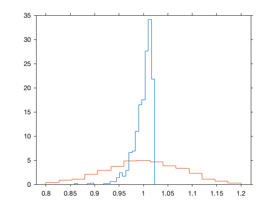
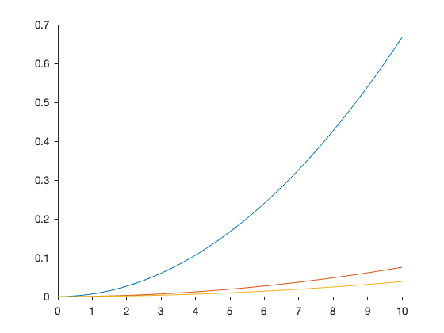
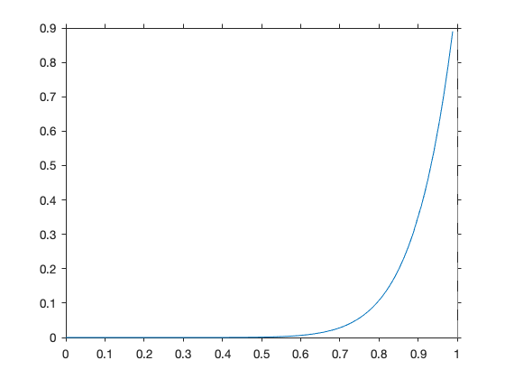

# Chapter 3 Estimators

## Part A

### Example 3.2

Simulation of the sampling distribution of the estimators $X_{(n)}(n+2)/(n+1)$ and $2 \bar X$. We take $1000$ independent sample of size $n = 50$ from $U(0,1)$.

The true $\theta$ is 1.


```matlab
rng(1000)
B = 1000;  n = 50;
T1 = zeros(1, B);
T2 = T1;

for i = 1:B
    u = rand(50,1);
    T2(i) = 2 * mean(u);
    T1(i) = max(u) * (n+2)/(n+1);
end
```


```matlab
mean(T2)
var(T2)
1/150
```

    ans =
        0.9993
    ans =
        0.0066
    ans =
        0.0067


```matlab
histogram(T1, 'Normalization', 'pdf', 'BinLimits', [0.8, 1.2], 'DisplayStyle', 'stairs')
hold
histogram(T2, 'Normalization', 'pdf', 'BinLimits', [0.8, 1.2], 'DisplayStyle', 'stairs')
hold
```

    Current plot held
    Current plot released





Compute and plot the difference $|T_1 -1| - |T_2 - 1|$ 


```matlab
plot(abs(T1 - 1) - abs(T2 -1))
refline(0)
```


### Estimate of the mean of normal density and standard error


```matlab
mu = 20 * rand(1);
n = 100;
x = mu + 5 * randn(n,1);
```


```matlab
mean(x)
```

    ans =
        9.9861


```matlab
se = 5/sqrt(n)
```

    se =
        0.5000


```matlab
mu
```

    mu =
        9.0865


### Example 3.6
 Comparison of estimators for the upper limit of a uniform distribution.


```matlab
n =50;
fplot(@(x) x.^2./(3*n), [0,10])
hold
fplot(@(x) 2 * x.^2./((n+2)*(n+1)), [0,10])
hold
```

    Current plot held
    Current plot released


The second estimator (in orange) is uniformly better of the first.

Below a comparison with the MSE of the estimator $X_{(n)} (n+2)/(n+1)$.


```matlab
n =50;
hold on 
fplot(@(x) x.^2./(3*n), [0,10])
fplot(@(x) 2 * x.^2./((n+2)*(n+1)), [0,10])
fplot(@(x) x.^2./((n+1)^2), [0,10])
hold off
```





## Part B 

### Example 3.9 Binomial

Three successes in 10 trials. Number of combinations removed.


```matlab
fplot(@(p) p.^(3) .* (1-p).^7, [0,1])
```


The log-likelihood appears different.


```matlab
fplot(@(p)log( p.^(3) .* (1-p).^7), [0.01,.99])
```


### Example 3.12 Exponential
Data for time until failure of a sample of electronic components (Kalbfleish). 


```matlab
x = [70,11,66,5,20,4,35,40,29,8];  % data set
n = length(x)
ml = 1/mean(x)
```

    n =
        10
    ml =
        0.0347


```matlab
likexp = @(lam) n * log(lam) - lam .* sum(x);
fplot(likexp, [0.001, 0.15])
hold
plot(1/mean(x), -43.9, 'xr')   
```

    Current plot held


### Example 3.13 Not differentiable likelihood

Binomial counts 10 successes in 10 trials.


```matlab
fplot(@(p) p.^10, [0,1])
```





### Example 3.14
Normal likelihood for the height in a sample of males.  


```matlab
male = [175.0000
  199.0000
  186.0000
  176.0000
  193.0000
  188.0000
  184.0000
  189.0000
  185.0000
  177.0000
  186.0000
  190.0000
  182.0000
  187.0000
  184.0000
  183.0000
  172.0000
  179.0000
  191.0000
  189.0000
  183.0000
  186.0000
  174.0000
  191.0000
  179.0000
  175.0000
  174.0000
  185.0000
  183.0000
  185.0000
  189.0000
  197.0000
  198.0000
  180.0000
  196.0000
  170.0000
  187.0000
  180.0000
  171.0000
  189.0000
  179.0000
  180.0000
  180.5000
  169.0000];
  n = length(male)
```

    n =
        44


```matlab
liknor = @(mu, s2) - (n/2) .* log(s2) - sum((male - mu).^2) ./ (2 * s2);

z = zeros(100);
mu = linspace(170, 200, 100);
s2 = linspace(20, 100, 100);

for i = 1:100
    for j = 1:100
        z(i,j) = liknor(mu(j), s2(i));
    end
end
colormap(winter)
contour(mu,s2,z, 100)
hold
plot(mean(male), (43/44)* var(male), 'xr' )
hold
```

    Current plot held
    Current plot released


### Example 3.15 Uniform distribution

A random sample of size $20$ from $[0, 100]$.  


```matlab
x = 100 .* rand(20, 1)';
```


```matlab
ml = max(x)
```

    ml =
       98.6427


```matlab
fplot(@(t) 1 ./ t.^20, [max(x), 110] )
```


### Example 3.18 Gamma distribution
Data on the duration of service (in minutes) for 15 bank customers. 


```matlab
x = [23.91 27.33 0.16 3.66 6.99 0.88 0.93 0.63 0.17 14.17 6.18 0.06 3.89 0.24 0.08];
n = length(x)
```

    n =
        15


```matlab
help psi
```

     PSI  Psi (polygamma) function.
        Y = PSI(X) evaluates the psi function for each element of X.
        X must be real and nonnegative.  SIZE(Y) is the same as SIZE(X).
        The psi function, also know as the digamma function, is the logarithmic
        derivative of the gamma function: 
     
           psi(x) = digamma(x) = d(log(gamma(x)))/dx = (d(gamma(x))/dx)/gamma(x).
     
        Y = PSI(K,X) evaluates the K-derivative of psi at the elements of X.
        For real integer-valued scalar K, SIZE(Y) is the same as SIZE(X).
        PSI(0,X) is the digamma function, PSI(1,X) is the trigamma function,
        PSI(2,X) is the tetragamma function, etc.
     
        Examples:
     
           -psi(1) = -psi(0,1) is Euler's constant, 0.5772156649015323.
     
           psi(1,2) = pi^2/6 - 1.
     
           x = (1:.005:1.250)';  [x gamma(x) gammaln(x) psi(0,x) psi(1,x) x-1]
           produces the first page of table 6.1 of Abramowitz and Stegun.
     
           x = (1:.01:2)'; [psi(2,x) psi(3,x)] is a portion of table 6.2.
     
        See also GAMMA, GAMMALN, GAMMAINC, GAMMAINCINV.
    
        Reference page in Doc Center
           doc psi
    
        Other functions named psi
    
           codistributed/psi    gpuArray/psi    sym/psi    tall/psi
    


```matlab
fun = @(a) sum(log(x)) + n * log(a) - n * log(mean(x)) - n*psi(a);

ml_a = fzero(fun, 0.5)  % 0.5 is the starting point
ml_lam = ml_a/mean(x)
```

    ml_a =
        0.4376
    ml_lam =
        0.0735


```matlab
likgamma = @(a, lam)  (a - 1) * sum(log(x)) + n * a * log(lam) - lam * sum(x) - n * gammaln(a);

z = zeros(100);
a = linspace(0.4, 0.48, 100);
lam = linspace(0.065, 0.08, 100);

for i = 1:100
    for j = 1:100
        z(i,j) = likgamma(a(j), lam(i));
    end
end

colormap(winter)
contour(a,lam,z, 20)
hold
plot(ml_a, ml_lam, 'xr')
hold
```

    Current plot held
    Current plot released


## Part C Bayesian estimators 
### The Beta density


```matlab
subplot(3,3,1)
fplot(@(p) betapdf(p, 0.5,0.5) , [0,1])
title('B(1/2,1/2)')
subplot(3,3,2)
fplot(@(p) betapdf(p, 0.5,1) , [0,1])
title('B(1/2,1)')
subplot(3,3,3)
fplot(@(p) betapdf(p, 1,0.5) , [0,1])
title('B(1,1/2)')
subplot(3,3,4)
fplot(@(p) betapdf(p, 1,1) , [0,1])
title('B(1,1)')
subplot(3,3,5)
fplot(@(p) betapdf(p, 1,2) , [0,1])
title('B(1,2)')
subplot(3,3,6)
fplot(@(p) betapdf(p, 2,1) , [0,1])
title('B(2,1)')
subplot(3,3,7)
fplot(@(p) betapdf(p, 2,2) , [0,1])
title('B(2,2)')
subplot(3,3,8)
fplot(@(p) betapdf(p, 2,6) , [0,1])
title('B(2,6)')
subplot(3,3,9)
fplot(@(p) betapdf(p, 6,2) , [0,1])
title('B(6,2)')

```


### Fig. 3.7
The prior is $Beta(25,5)$. On top 3 samples from $Bin(n=25, p = 1/2)$. On bottom 
3 samples from $Bin(n = 100, p = 1/2)$.

The prior is quite concentrated on $p = 25/30$.


```matlab
rng(101)
n = 25;
alpha = 25;
beta = 5;
p = 1/2;
subplot(2,1,1)
hold on
for i = 1:3
    fplot(@(p) betapdf(p, 25,5), [0,1], '--')
    x = binornd(n,p);
    fplot(@(p) betapdf(p,alpha + x, beta + n - x), [0,1])
    plot((alpha + x)/(alpha + beta + n),0, 'xr') 
end
hold off

n = 100;
alpha = 25;
beta = 5;
p = 1/2;
subplot(2,1,2)
hold on
for i = 1:3
    fplot(@(p) betapdf(p, 25,5), [0,1], '--')
    x = binornd(n,p);
    fplot(@(p) betapdf(p,alpha + x, beta + n - x), [0,1])
    plot((alpha + x)/(alpha + beta + n),0, 'xr') 
end
hold off

```


### Figure 3.8
Mean square error of the Bayes estimators with $n = 20$.


```matlab
mse = @(x, a, b) (x.^2 .* ((a + b).^2 - n) + x .* (n - 2 * a .* (a + b)) + a.^2) ./ (n + a + b).^2;
```


```matlab
hold on
n = 20;
a = 1; b = 1; 
fplot(@(x) mse(x,a,b), [0,1])
a = (1/2)*sqrt(n); b = (1/2)*sqrt(n);
fplot(@(x) mse(x,a,b), [0,1])
a = 0; b = 0;   
fplot(@(x) mse(x,a,b), [0,1])
hold off
```


