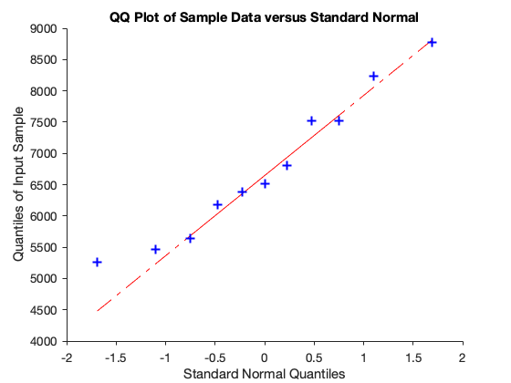

# Chapter 4 Hypothesis testing

## Example 4.3 Two samples

Test the difference of two means. The box-plot is not helpful.


```matlab
rng = 123;
x = normrnd(0, 1, 26,1);
y = normrnd(0.5, 0.8, 15,1);
x'
y'

grp = [ones(1, 26), ones(1, 15)*2];
grp
boxplot([x;y], grp)
```

    ans =
      Columns 1 through 7
        0.5377    1.8339   -2.2588    0.8622    0.3188   -1.3077   -0.4336
      Columns 8 through 14
        0.3426    3.5784    2.7694   -1.3499    3.0349    0.7254   -0.0631
      Columns 15 through 21
        0.7147   -0.2050   -0.1241    1.4897    1.4090    1.4172    0.6715
      Columns 22 through 26
       -1.2075    0.7172    1.6302    0.4889    1.0347
    ans =
      Columns 1 through 7
        1.0815    0.2572    0.7351   -0.1298    1.2107   -0.4177   -0.3551
      Columns 8 through 14
       -0.1476   -1.8554    1.6507    0.7602   -0.1039    1.5962   -0.8692
      Column 15
        0.4182
    grp =
      Columns 1 through 13
         1     1     1     1     1     1     1     1     1     1     1     1     1
      Columns 14 through 26
         1     1     1     1     1     1     1     1     1     1     1     1     1
      Columns 27 through 39
         2     2     2     2     2     2     2     2     2     2     2     2     2
      Columns 40 through 41
         2     2


### Warning on tail probabilities 
Calculation of upper tail probabilities of a discrete distribution in Matlab.

Let $X \sim Bin(25, 0.6)$. 


```matlab
n = 25; p = 0.6;  
```

Example 1. Calculate $P(X \le 15)$.


```matlab
sum(binopdf(0:15, n,p))
```

    ans =
        0.5754


```matlab
binocdf(15, n, p)
```

    ans =
        0.5754


That's easy. 

Example 2. Now Calculate $P(X\ge 20)$.


```matlab
1- binocdf(20, n,p)
disp('WRONG!')
```

    ans =
        0.0095
    WRONG!


```matlab
binocdf(20, n,p, 'upper')
disp('WRONG!')
```

    ans =
        0.0095
    WRONG!


```matlab
sum(binopdf(20:25, n,p))
disp('CORRECT.')
```

    ans =
        0.0294
    CORRECT.


So you must be careful!

You can do it correctly with `cdfbino` using $x = 20-1$:


```matlab
binocdf(19, n,p, 'upper')
1- binocdf(19, n,p)
```

    ans =
        0.0294
    ans =
        0.0294


### Example 4.11 Binomial Test
Power function $p \mapsto P_p(X \ge 59)$.


```matlab
pow_bin = @(p) binocdf(58, 100, p, 'upper');
```


```matlab
fplot(pow_bin, [0,1])
vline(0.5, '-')
hline(0.05)
```


### Figure 4.4 
The function $x \mapsto P_{0.5}(X\ge x)$ for $X \sim Bin(100, 0.5)$.


```matlab
bino = @(x)  1 - binocdf(x-1, 100, 0.5);
```


```matlab
fplot(bino, [0, 100])

hline(0.05)
```


```matlab
fplot(bino, [57, 60])

hline(0.044)
hline(0.05)
hline(0.067)
```


### Figure 4.5 Power function for the Gauss test
- Red. One sided test $H_0: \mu \le 0$ vs $H_1: \mu > 0$
- Blue. One sided test $H_0: \mu \ge 0$ vs $H_1: \mu < 0$
- Yellow. Two-sided test $H_0 \mu = \mu_0$ vs $H_1: \mu \ne \mu_0$


```matlab
n = 5;
a0 = 0.05;
mu0 = 0;
sigma = 2;
pow_gauss_R = @(mu) 1 - normcdf(norminv(1-a0,0,1) + sqrt(n) .* (mu0 - mu) ./ sigma);
fplot(pow_gauss_R, [-3,3])

hold on

pow_gauss_L = @(mu) normcdf(-norminv(1-a0,0,1) + sqrt(n) .* (mu0 - mu) ./ sigma);
fplot(pow_gauss_L, [-3,3])

pow_gauss_2 = @(mu) 1 - normcdf( norminv(1-a0/2)  - sqrt(n) .*(mu - mu0) ./ sigma) +  normcdf(norminv(a0/2) - sqrt(n) .*(mu-mu0) ./sigma);
fplot(pow_gauss_2, [-3,3])


hline(0.05)
hold off
```


Note that `normcdf(x)` is the distribution function of $N(0,1)$ that is $\Phi(x)$, and `norminv(a)` is the $\alpha-$ quantile of the $N(0,1)$.

### Example 4.15 Gauss test, power function

Compare $n = 5$ with $n = 50$.


```matlab
a0 = 0.05;
mu0 = 0;
sigma = 2;
n = 5;
pow_gauss_R = @(mu) 1 - normcdf(norminv(1-a0,0,1) + sqrt(n) .* (mu0 - mu) ./ sigma);
fplot(pow_gauss_R, [-3,3])
hold on
n = 50;
pow_gauss_R = @(mu) 1 - normcdf(norminv(1-a0,0,1) + sqrt(n) .* (mu0 - mu) ./ sigma);
fplot(pow_gauss_R, [-3,3])
hline(a0)
vline(0,'-k')
hold off
```


Compare $\sigma = 2$ with $\sigma = 4$.


```matlab
n = 50;
a0 = 0.05;
mu0 = 0;
sigma = 2;
pow_gauss_R = @(mu) 1 - normcdf(norminv(1-a0,0,1) + sqrt(n) .* (mu0 - mu) ./ sigma);
fplot(pow_gauss_R, [-3,3])
hold on
sigma = 4;
pow_gauss_R = @(mu) 1 - normcdf(norminv(1-a0,0,1) + sqrt(n) .* (mu0 - mu) ./ sigma);
fplot(pow_gauss_R, [-3,3])
hline(a0)
vline(0,'-k')
hold off

```


Compare $\alpha_0 = 0.05$ with $\alpha_0 = 0.10$.


```matlab
n = 10;
a0 = 0.05;
mu0 = 0;
sigma = 2;
pow_gauss_R = @(mu) 1 - normcdf(norminv(1-a0,0,1) + sqrt(n) .* (mu0 - mu) ./ sigma);
fplot(pow_gauss_R, [-3,3])
hold on
hline(a0)
a0 = 0.1;
pow_gauss_R = @(mu) 1 - normcdf(norminv(1-a0,0,1) + sqrt(n) .* (mu0 - mu) ./ sigma);
fplot(pow_gauss_R, [-3,3])
hline(a0)
vline(0, '-k')
hold off
```


### Example 4.16

Solution of the system to find the minimal sample size.


```matlab
syms n positive
solve((n+1)/2 + 1.645 * sqrt(n)/2 - n *0.6 - 1/2 + 0.842 *sqrt(n*0.24), n)
```

    ans =
    ((421*6^(1/2))/250 + 329/40)^2


```matlab
eval(ans)
```

    ans =
      152.5210


###  Example 4.18 Contaminated pool water

Transform $H_0: p_\mu \le 0.05$ where $p_\mu = P_\mu (X > 100)$ into $H_0': \mu \le 85.05$.


```matlab

syms mu positive
fzero(@(mu) poissinv(0.95, mu) - 100.5, 50)
```

    ans =
       85.0571


```matlab

fplot(@(mu) poissinv(0.95, mu), [0, 110])
hline(100)
vline(85.0571)
```


### The t distribution

Figure 4.10. Densities of the t-distributions with 1 (blue), 5 (red), and $\infty$ degrees
of freedom. 


```matlab
fplot(@(x) tpdf(x, 1), [-4, 4]); hold on 
fplot(@(x) tpdf(x, 5), [-4, 4]); 
fplot(@(x) normpdf(x), [-4, 4]); hold off
```


### Example from Altman
Daily intake in KJ for 11 women.


```matlab
daily_intake = [5260,5470,5640,6180,6390,6515,6805,7515,7515,8230,8770];
```


```matlab
qqplot(daily_intake)
```





Test that $H_0: \mu \le 6000$ against $H_1: \mu > 6000$

First with Gauss test assuming $\sigma = 1200$


```matlab
[H, p, ~, stats] = ztest(daily_intake, 6000, 1200, 'tail', 'right', 'alpha', 0.02)
```

    H =
         1
    p =
        0.0186
    stats =
        2.0829


```matlab
(mean(daily_intake) - 6000)/(1200/sqrt(11))
```

    ans =
        2.0829


```matlab
1-normcdf(2.0829)
```

    ans =
        0.0186


Test significant.

Then use a t-test.


```matlab
[H, p, ~, stats] = ttest(daily_intake, 6000, 'tail', 'right', 'alpha', 0.02)
```

    H =
         0
    p =
        0.0267
    stats = 
      struct with fields:
    
        tstat: 2.1885
           df: 10
           sd: 1.1421e+03


```matlab
sqrt(11) * (mean(daily_intake) - 6000)/std(daily_intake)
```

    ans =
        2.1885


```matlab
pval = 1-tcdf(2.1885,10)
```

    pval =
        0.0267


### Example. Sign test
Sign test for the hypothesis $H_0 : \mu \le 6000$ where $\mu$ is now the median.


```matlab
sign(daily_intake - 6000)
```

    ans =
        -1    -1    -1     1     1     1     1     1     1     1     1


```matlab
pval = 1-binocdf(7, 11, 1/2)
```

    pval =
        0.1133


```matlab
[p,H] = signtest(daily_intake, 6000,'tail','right')
```

    p =
        0.1133
    H =
      logical
       0


### Example 4.33 Student t test for paired samples
Example from Dobson. The weights, in kilograms, of twenty men before and after participation in a ‘waist loss’ program are considered (Egger et al., 1999) We want to know if, on average, they retain a weight loss twelve months after the program.


```matlab
before = [100.8 102.0 105.9 108.0 92.0 116.7 110.2 135.0 123.5 95.0 ...
105.0 85.0 107.2 80.0 115.1 103.5 82.0 101.5 103.5 93.0]';
after = [
97.0 107.5 97.0 108.0 84.0 111.5 102.5 127.5 118.5 94.2 ...
105.0 82.4 98.2 83.6 115.0 103.0 80.0 101.5 102.6 93.0]';
XY = [before after]
```

    XY =
      100.8000   97.0000
      102.0000  107.5000
      105.9000   97.0000
      108.0000  108.0000
       92.0000   84.0000
      116.7000  111.5000
      110.2000  102.5000
      135.0000  127.5000
      123.5000  118.5000
       95.0000   94.2000
      105.0000  105.0000
       85.0000   82.4000
      107.2000   98.2000
       80.0000   83.6000
      115.1000  115.0000
      103.5000  103.0000
       82.0000   80.0000
      101.5000  101.5000
      103.5000  102.6000
       93.0000   93.0000


```matlab
z = before - after; 
qqplot(z)
[H, p, ~, stats] = ttest(z, 0, 'tail', 'right')
```

    H =
         1
    p =
        0.0049
    stats = 
      struct with fields:
    
        tstat: 2.8734
           df: 19
           sd: 4.1167


Assuming normality there is a strong evidence against the null $H_0: \Delta \le 0$ because $p < 0.01$. Normality is however questionable. 

### Example  t-test for independend samples

Example from Maindonald. Consider data from an experiment in which 21 elastic bands were randomly divided into two groups, one of 10 and one of 11. Bands in the first group were immediately tested for the amount that they stretched under a weight of 1.35 kg. The other group were dunked in hot water at 65$\circ$ C for four minutes, then left at air temperature for ten minutes, and then tested for the amount that they stretched under the same 1.35 kg weight as before. 


```matlab
ambient= [254 252 239 240 250 256 267 249 259 269]'; 
heated= [233 252 237 246 255 244 248 242 217 257 254]'; 
[mean(ambient) std(ambient)]
[mean(heated) std(heated)]
boxplot([ambient; heated], [ones(10,1); ones(11,1)*2])
```

    ans =
      253.5000    9.9247
    ans =
      244.0909   11.7342


Is the difference of means significant (provided that the variances were equal)?


```matlab
[H, p, ~ , st] = ttest2(ambient, heated, 'tail', 'both')
```

    H =
         0
    p =
        0.0632
    st = 
      struct with fields:
    
        tstat: 1.9730
           df: 19
           sd: 10.9145


The difference is not significant (actually there is a borderline evidence against the null).

### Empirical Distribution function 

Figure 4.12. The empirical distribution function of a sample of size 25 from the $N(0, 1)$ distribution and the actual distribution function.


```matlab
clear
rng(204)
n = 25;
x = normrnd(0,1,25,1);
```


```matlab
cdfplot(x)
hold on
fplot(@(u) normcdf(u), [-3,3])
hold off
```


### Kolmogorov Smirnov test
Data on grades (scale 0-100) on an exam. The a Kolmogorov-Smirnov test is applied for te null $H_0: F \sim F_0 = N(75,10)$. That is test the null hypothesis that the data comes from a normal distribution with a mean of 75 and a standard deviation of 10.  First data are standardized with respect to $\mu_0 = 75$ and $\sigma_0 = 10$ and the empirical distribution function is plotted against the standard normal.


```matlab
load examgrades
test1 = grades(:,1);
[mean(test1) std(test1)]
x = (test1-75) ./ 10;
```

    ans =
       75.0083    8.7202


```matlab
[test1 x]
```

    ans =
       65.0000   -1.0000
       61.0000   -1.4000
       81.0000    0.6000
       88.0000    1.3000
       69.0000   -0.6000
       89.0000    1.4000
       55.0000   -2.0000
       84.0000    0.9000
       86.0000    1.1000
       84.0000    0.9000
       71.0000   -0.4000
       81.0000    0.6000
       84.0000    0.9000
       81.0000    0.6000
       78.0000    0.3000
       67.0000   -0.8000
       96.0000    2.1000
       66.0000   -0.9000
       73.0000   -0.2000
       75.0000         0
       59.0000   -1.6000
       71.0000   -0.4000
       69.0000   -0.6000
       63.0000   -1.2000
       79.0000    0.4000
       76.0000    0.1000
       63.0000   -1.2000
       85.0000    1.0000
       87.0000    1.2000
       88.0000    1.3000
       80.0000    0.5000
       71.0000   -0.4000
       65.0000   -1.0000
       84.0000    0.9000
       71.0000   -0.4000
       75.0000         0
       81.0000    0.6000
       79.0000    0.4000
       64.0000   -1.1000
       65.0000   -1.0000
       84.0000    0.9000
       77.0000    0.2000
       70.0000   -0.5000
       75.0000         0
       84.0000    0.9000
       75.0000         0
       73.0000   -0.2000
       92.0000    1.7000
       90.0000    1.5000
       79.0000    0.4000
       80.0000    0.5000
       71.0000   -0.4000
       73.0000   -0.2000
       71.0000   -0.4000
       58.0000   -1.7000
       79.0000    0.4000
       73.0000   -0.2000
       64.0000   -1.1000
       77.0000    0.2000
       82.0000    0.7000
       81.0000    0.6000
       59.0000   -1.6000
       54.0000   -2.1000
       82.0000    0.7000
       57.0000   -1.8000
       79.0000    0.4000
       79.0000    0.4000
       73.0000   -0.2000
       74.0000   -0.1000
       82.0000    0.7000
       63.0000   -1.2000
       64.0000   -1.1000
       73.0000   -0.2000
       69.0000   -0.6000
       87.0000    1.2000
       68.0000   -0.7000
       81.0000    0.6000
       73.0000   -0.2000
       83.0000    0.8000
       73.0000   -0.2000
       80.0000    0.5000
       73.0000   -0.2000
       73.0000   -0.2000
       71.0000   -0.4000
       66.0000   -0.9000
       78.0000    0.3000
       64.0000   -1.1000
       74.0000   -0.1000
       68.0000   -0.7000
       67.0000   -0.8000
       75.0000         0
       75.0000         0
       80.0000    0.5000
       85.0000    1.0000
       74.0000   -0.1000
       76.0000    0.1000
       80.0000    0.5000
       77.0000    0.2000
       93.0000    1.8000
       70.0000   -0.5000
       86.0000    1.1000
       80.0000    0.5000
       81.0000    0.6000
       83.0000    0.8000
       68.0000   -0.7000
       60.0000   -1.5000
       85.0000    1.0000
       64.0000   -1.1000
       74.0000   -0.1000
       82.0000    0.7000
       81.0000    0.6000
       77.0000    0.2000
       66.0000   -0.9000
       85.0000    1.0000
       75.0000         0
       81.0000    0.6000
       69.0000   -0.6000
       60.0000   -1.5000
       83.0000    0.8000
       72.0000   -0.3000


```matlab
cdfplot(x); hold
fplot(@(x) normcdf(x), [-3,3], 'r-')
```

    Current plot held


```matlab
 [h,p,kstat] = kstest(x)
```

    h =
      logical
       0
    p =
        0.5612
    kstat =
        0.0707


There is no evidence against the null.

### Chi square test

The test statistic is 
$$
X^2 = \sum_{j=1}^k \frac{(N_j - n p_j)^2}{n p_j}
$$

Same example as before. 

Test against standard normal (mean 0, standard deviation 1).


```matlab
[h,p, stats] = chi2gof(x,'cdf',@normcdf)
```

    h =
         0
    p =
        0.1153
    stats = 
      struct with fields:
    
        chi2stat: 14.2017
              df: 9
           edges: [1x11 double]
               O: [4 5 14 11 29 14 22 14 4 3]
               E: [1x10 double]


Test against a general normal with parameters estimated. 
The degrees of freedom are  $df = k - 1$. The number of bins is $10$ by default. 


```matlab
[h,p, stats] = chi2gof(test1)
```

    h =
         0
    p =
        0.0626
    stats = 
      struct with fields:
    
        chi2stat: 10.4832
              df: 5
           edges: [1x9 double]
               O: [9 14 11 29 14 22 14 7]
               E: [8.8927 11.2029 17.6673 22.1913 22.2013 17.6913 11.2283 8.9249]


Degrees of freedom are $df = k - 1 - 2$ where $2$ is the number of estimated parameters. Here $k = 8$.

More information with `help chi2gof`

### Likelihood ratio test

E simple example: assume that $X \sim Bin(100, p)$ and that we wand to test $H_0: p = 1/2$ against $H_1: p \ne 1/2$. The likelihood ratio statistic is 
$$
\lambda(X) = \frac{L(\hat p, X)}{L(p_0, X)}.
$$
We reject for large value of the statistic. Below you see the value of the statistic for $x = 60$.


```matlab
n = 100; x = 60; phat = x/n; p0 = 1/2;
lambda = binopdf(x, n, phat) / binopdf(x, n, p0)
```

    lambda =
        7.4899


```matlab
fplot(@(p) binopdf(x, n, p), [0,1])
vline(0.5, '-')
hline(binopdf(x, n, p0))
```


### The logarithm of the likelihood ratio test 

Consider twice the log of the likelihood ratio statistic
$$
2 \log L(\hat p)/L(p_0) = 2 \{ \ell(\hat p) - \ell(p_0) \}
$$
We plot it as a function of $p_0$ for a given $x = 60$. 


```matlab
fplot(@(p0) 2 * log( binopdf(60, 100, 0.6) ./ binopdf(60, 100, p0)), [0,1])
vline(0.5, '-')
```


```matlab
lambda
2 * log(lambda)
1 - chi2cdf(4.0271, 1)
chi2inv(0.95, 1)
chi2inv(0.99, 1)
```

    lambda =
        7.4899
    ans =
        4.0271
    ans =
        0.0448
    ans =
        3.8415
    ans =
        6.6349


The function shows the value of the statistic that increases as we move away from the MLE $\hat p = 0.6$.

### A simulation for the sampling distribution of the likelihood ratio

We simulate many samples of size $n = 500$ under the hypoyhesis $p = 1/2$, computing the statistic $2 \log \lambda$. We verify that the empirical distribution is approximately $\chi^2_1$.


```matlab
B = 1000; 
p0 = 1/2;
n = 500;
x = zeros(1,B);
LR = zeros(1,B);
for b = 1:B
    x(b) = binornd(n, 1/2);
    ph = x(b)/n;
    LR(b) = 2 * log( binopdf(x(b), n, ph) ./ binopdf(x(b), n, p0));
end

histogram(LR, 40, 'Normalization', 'pdf')
hold on
fplot(@(x) chi2pdf(x,1), [0,10])
```


