# Chapter 5 Confidence intervals

### Example. The simplest confidence interval

$X \sim N(\theta, 1)$. Consider the interval $[X - 1.96, X + 1.96]$. Now simulate $100$ intervals given $\theta = 12$ and plot them.  


```matlab
theta = 12;
figure()
hold on
for i = 1:100
    x = normrnd(theta, 1, 1);
    if x - 1.96 <= theta & theta <= x + 1.96
        plot([x-1.96; x+1.96], [i; i], '-b');
    else
        plot([x-1.96; x+1.96], [i; i], '-r');
    end
end
hold off
vline(theta);
```


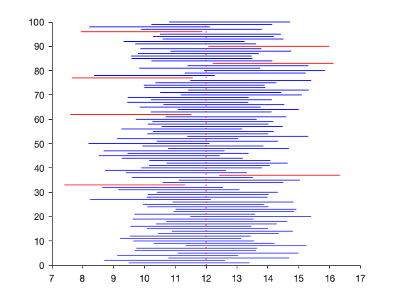


### Example 5.4 Intervals based on the Student's t distribution

Le $(X_1, \dots, X_5) \sim N(\mu, \sigma^2)$ iid. Then  $T = {\surd n} (\bar X - \mu)/S_X \sim t_4$. The quantiles $t_{5, 0.025}$ and   $t_{5, 0.975}$ are 


```matlab
[tinv(0.025, 4), tinv(0.975, 4)] 
```

    ans =
       -2.7764    2.7764


Therefore the interval with extremes
$$
L(X) = \bar X - 2.7764 S_X/\surd 5,\qquad  R(X) = \bar X +2.7764 S_X/\surd 5 
$$
is a CI of level $0.95$. Now we simulate
100 samples and the sequence of confidence intervals of level $0.95$.


```matlab
theta = 12; sigma = 1; n = 5;
figure()
hold on
for i = 1:100
    x = normrnd(theta, sigma, n,1);  % sample of size n=5
    xbar = mean(x);
    sx = std(x);
    se = sx/sqrt(n);
    t = tinv(0.975, n-1);
    L = xbar - t * se;
    R = xbar + t * se;
    if L<= theta & theta <= R
        plot([L; R], [i; i], '-b');
    else
        plot([L; R], [i; i], '-r');
    end
end
hold off
vline(theta);
```


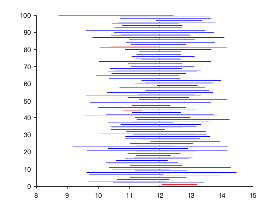


### Example. Glomerular filtration rate
Data from Efron and Hastie and Dr. Myers’ nephrology laboratory: glomerular filtration rates is measured for $211$. `gfr` is an important indicator of kidney function, with low values suggesting trouble.

We want a confidence interval for the mean gfr. 


```matlab
gfr = [108
91
62
59
84
60
71
105
70
69
66
65
78
83
82
68
107
68
68
69
80
75
89
68
64
68
70
57
62
87
51
55
56
57
75
98
60
68
81
47
76
48
63
58
40
62
61
58
38
40
45
68
56
64
49
53
50
39
54
47
37
50
54
70
49
57
52
47
43
52
57
46
63
56
50
51
50
42
46
56
52
59
45
50
59
44
52
54
53
63
45
56
55
53
56
46
45
49
63
50
41
42
53
50
58
50
37
53
58
49
53
51
64
44
53
53
55
43
50
60
51
55
56
52
51
45
49
51
63
48
51
60
45
40
50
66
62
69
53
54
49
47
63
55
62
57
58
51
50
57
62
45
47
52
35
41
53
48
59
45
41
52
36
84
62
31
41
48
47
50
50
57
53
37
46
41
56
51
39
59
53
51
49
45
42
32
55
34
43
35
48
33
41
38
57
37
40
34
44
43
62
36
41
51
48
31
28
33
35
48
31];
```


```matlab
histogram(gfr, 15)
```


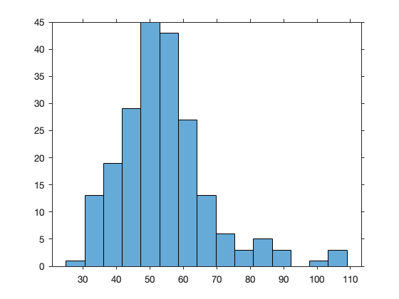


```matlab
qqplot(gfr)
```


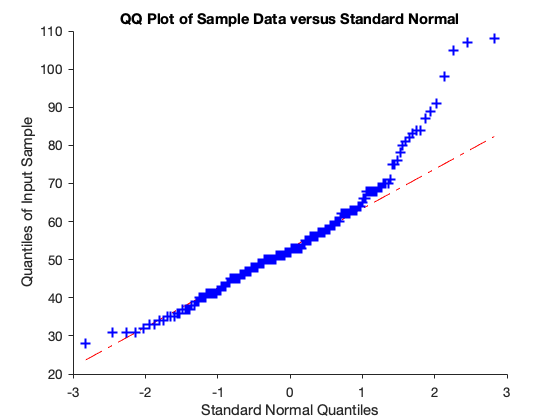


The QQ-plot indicates that the normality assumption is not valid for the right tail. However the sample size is large. So we use a confidence interval based on the $T$ pivot. 


```matlab
n = length(gfr)
xbar = mean(gfr)
me = median(gfr)
sx = std(gfr)
```

    n =
       211
    xbar =
       54.2654
    me =
        52
    sx =
       13.7209


```matlab
alpha = 0.05
[muhat,sx,CI] = normfit(gfr,1-alpha)
```

    alpha =
        0.0500
    muhat =
       54.2654
    sx =
       13.7209
    CI =
       54.2061
       54.3247


```matlab
t = tinv(1-alpha/2, n-1) 
```

    t =
        1.9713


```matlab
half = t * sx/sqrt(211)
```

    half =
        1.8621


```matlab
ci = [xbar - half xbar + half]
```

    ci =
       52.4033   56.1275


### Example 5.2 Near pivot for the Binomial
Solve the equation
$$
(X - n p)^2 \le \xi_{1-\alpha/2}^2(n p (1-p))
$$


```matlab
x = 13 
n = 20
syms p positive
z = solve((x - n * p)^2 - 1.96^2 *n * p * (1-p) == 0, p)
eval(z)
```

    x =
        13
    n =
        20
    z =
     6217/9934 - (98*861^(1/2))/14901
     (98*861^(1/2))/14901 + 6217/9934
    ans =
        0.4329
        0.8188


The observed confidence interval is $[0.4329, 0.8188]$. Below we show graphically the interval 
such that $|x - n p| \le \xi_{1-\alpha/2} \sqrt{n p (1-p)}$.


```matlab
fplot(@(p) abs(x - n * p), [0,1]); hold on
fplot(@(p) 1.96 .* sqrt(n .* p .* (1-p)), [0,1]); hold off
vline(0.4329); vline(0.8188)
```


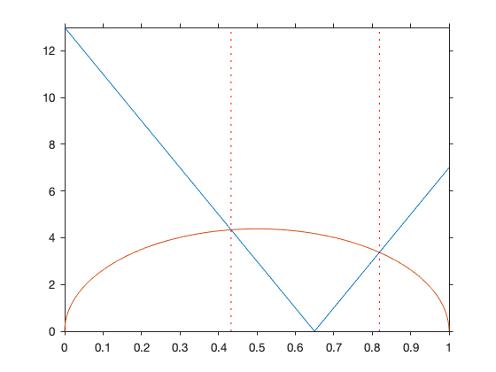


### Binomial log-likelihood and observed information

The model is $X\sim Bin(n, \theta)$. The observed information in the maximum likelihood point $\hat \theta = x/n$ is 
$$
\widehat{i}_{\hat\theta} = \frac{n}{\hat \theta(1-\hat \theta)}.
$$
The quadratic approximation to the normalized likelihood is
$$
Q(\theta) = -\frac{1}{2} \Big(\frac{n}{\hat \theta(1-\hat \theta)}\Big)(\theta - \hat \theta)^2
$$


```matlab
n = 100
x = 20
th = linspace(0.001, 0.999, 100);
llik = @(th) x .* log(th) + (n-x) .* log(1-th) - x .* log(x./n) - (n-x) .* log(1-x./n); 
plot(th, llik(th))
axis([0 1 -30 0])
hold on 
quad = @(th) (-1/2) .* (n ./ ( (x./n) .* (1 - x./n))) .* (th - x./n).^2;
plot(th, quad(th))
vline(x/n)
hold off
```

    n =
       100
    x =
        20


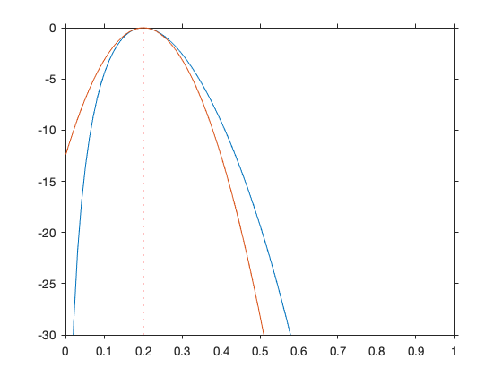


Compare with larger sample sizes and the same MLE.

### Multidimensional parameters
Fisher information matrix for the parameter $p$ of the multinomial. Here $p = (p_1, p_2, p_3)^T$ with $\sum_{i=1}^3 p_i = 1$. Thus we compute the matrix only for $p_1, p_2$. 


```matlab
clear
syms p1 p2 p3 positive

i_p = (ones(2) - eye(2)) ./ p3 + diag([1/p1 + 1/p3, 1/p2 + 1/p3])
```

    i_p =
    [ 1/p1 + 1/p3,        1/p3]
    [        1/p3, 1/p2 + 1/p3]


Inverse of the Fisher information matrix.


```matlab
p3 = 1 - p1 - p2;
ii_p = simplify(inv(eval(i_p)))
```

    ii_p =
    [ -p1*(p1 - 1),       -p1*p2]
    [       -p1*p2, -p2*(p2 - 1)]


The inverse can be written as $I_2 - p p^T$.

### Confidence region for $(p_1, p_2)$ 

Data on pneumoconiosis for $43$ miners after $20$ years of work
$$
\begin{array}{cccc}\hline
Severe & Present & Absent & Total \\
3 & 6 & 34 & 43 \\ \hline
\end{array}
$$
Compute the estimates of $p$, the estimated information matrix and the $95\%$ confidence region.


```matlab
clear;
n = 43;
ph1 = 3/n; 
ph2 = 6/n;
ph3 = 34/n;

i_ph = [1/ph1 + 1/ph3 , 1/ph3
        1/ ph3,  1/ph2 + 1/ph3] % inverse of the asymptotic covariance matrix
K = inv(n * i_ph)               % asymptotic covariance matrix
ph = [ph1; ph2]
k = chi2inv(0.95, 2)
plot_ellipse(ph, K, sqrt(k))
vline(ph1)
hline(ph2)
```

    i_ph =
       15.5980    1.2647
        1.2647    8.4314
    K =
        0.0015   -0.0002
       -0.0002    0.0028
    ph =
        0.0698
        0.1395
    k =
        5.9915


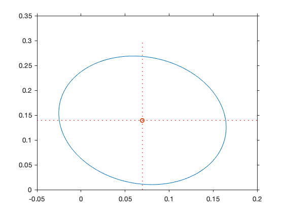


Note that the region contains  negative probabilities ! 

### Example for the delta method


```matlab
n = 200; x = 120; 
th = x/n
phi = log(th/(1-th))
```

    th =
        0.6000
    phi =
        0.4055


```matlab
seh = 1/sqrt(n* th *(1-th))
```

    seh =
        0.1443


```matlab
[phi - 1.96 * seh , phi + 1.96 * seh]
```

    ans =
        0.1226    0.6884


### Plot a dispersion ellipse on a scatter


```matlab
z1 = randn(1000,1);
z2 = randn(1000,1);
A = [5 1;1 5];
X = [z1 z2] * A;
M = A * A'
plot(X(:,1), X(:,2), '.')
hold on 
plot_ellipse([0 0]', M, sqrt(chi2inv(0.95,2)))
```

    M =
        26    10
        10    26


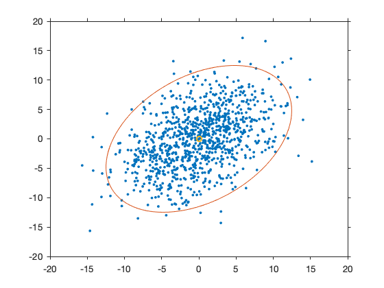


### Example 5.23 Confidence interval for the exponential parameter 

Dieci lampadine sono lasciate accese per 40 giorni. $X$ sono le durate delle lampadine. Assumendo che $X$ sia esponenziale con parametro $\lambda$ trovare un intervallo di confidenza al 95% per $\lambda$. 


```matlab
clear
x = [25    11    12     7     5     4    19     6     6    27]';
n = length(x);
```

La stima di massima verosimiglianza è $\hat \lambda = 1/\bar x$.


```matlab
lh = 1/mean(x)
```

    lh =
        0.0820


Definisco la log-verosimiglianza normalizzata.


```matlab
s = sum(x);
llexp = @(lam) n .* log(lam) - lam .* s  -  n .* log(lh) + lh .* s  
```

    llexp =
      function_handle with value:
        @(lam)n.*log(lam)-lam.*s-n.*log(lh)+lh.*s


Intervallo di confidenza ottenuto tagliando la log-verosimiglianza relativa


```matlab
fplot(llexp, [0.01, .2])
vline(lh)
hline(-3.84/2)
```


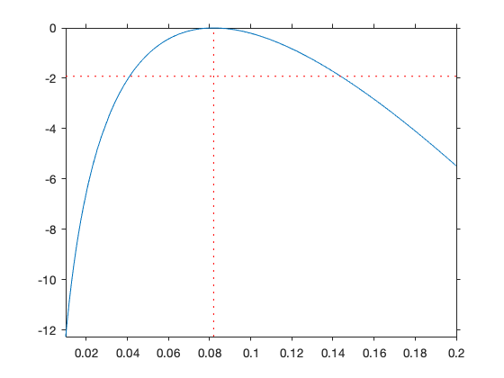


```matlab
syms l  real
fun  = @(l) llexp(l) + 1/2 *3.84
R = fzero(fun, 0.1)
L = fzero(fun, 0.04)
```

    fun =
      function_handle with value:
        @(l)llexp(l)+1/2*3.84
    R =
        0.1438
    L =
        0.0411


```matlab
fplot(llexp, [0.01, .2])
vline(lh)
hline(-3.84/2)
vline(L)
vline(R)
```


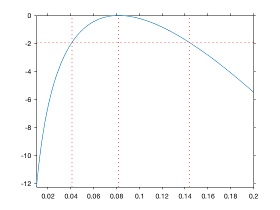


### Example (Gelman et al.) 

(Wikipedia) Placenta praevia is when the placenta attaches inside the uterus but near or over the cervical opening.

La placenta previa è considerata una delle emergenze ostetriche del terzo trimestre di gravidanza, soprattutto durante il parto. Anatomicamente la placenta si viene a trovare davanti alla parte di presentazione fetale. Può essere causa di emorragie gravi.

We are interested in estimation of the proportion $\theta$  of female births in the population of the placenta previa births. Is $\theta < 0.485$, the proportion of female births in the general population?

Data: a study in Germany found that of  $n = 980$ placenta previa births, $x = 437$ were female.

Model: $ X \sim Bin(980, \theta)$ and prior $\theta \sim U(0,1) = Beta(1,1)$.

Likelihood: $\theta^{437}(1 - \theta)^{980-437}$

Posterior: $Beta(438, 544)$

Posterior mean: $438/982 = 0.4460285$


```matlab
post = @(x) betapdf(x, 438, 544);
```


```matlab
fplot(post, [0.38,0.52])
```


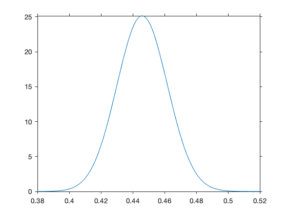


Note that we can also simulate the posterior


```matlab
theta = betarnd(438, 544, 10000,1);
histogram(theta, 50, 'Normalization', 'pdf', 'DisplayStyle', 'stairs')
hold on 
fplot(post, [0.38,0.52])
hold off
```


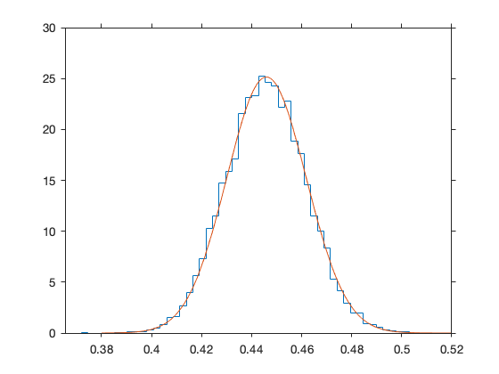


Credibile intervals of level $0.5,  0.95$. The second is approximate, obtained via simulation


```matlab
betainv([.025, .25, .75, .975], 438, 544)
```

    ans =
        0.4151    0.4353    0.4567    0.4772


```matlab
quantile(theta,[.025, .25, .75, .975] )
```

    ans =
        0.4148    0.4350    0.4563    0.4773


Credible interval 95%: $[0.4151, 0.4772]$

Probability that $\theta < 0.485$ is $0.9928$


```matlab
betacdf(0.485, 438, 544)
```

    ans =
        0.9928


### Example of a HPD credible interval

$X \sim Bin(10, \theta)$, $\theta\sim Beta(1,1)$. Observed $x =2$.


```matlab
a = betainv(0.025, 3,9);
b = betainv(0.975, 3,9);
q = [a b]       % Quantile based interval


alpha = 0.05;
fun  = @(u) betainv((1-alpha) + u, 3, 9) - betainv(u, 3,9);
g = fminbnd(fun, 0, alpha);
h = [betainv(g, 3,9)   betainv(1-alpha + g, 3, 9)]
%g = linspace(0, alpha, 100);
%l = quantile(theta, g);
%r = quantile(theta, (1-alpha)+g);
%[u,i] = min(r-l);
%h = [l(i) r(i)]     % HPD interval
```

    q =
        0.0602    0.5178
    h =
        0.0405    0.4837


```matlab
post = @(x) betapdf(x, 3,9);
fplot(post, [0,1])
vline([q(1), q(2)])
line([q(1); q(2)],[betapdf(q(1), 3, 9), betapdf(q(2), 3, 9)])

vline([h(1), h(2)])
line([h(1); h(2)],[betapdf(h(1), 3, 9), betapdf(h(2), 3, 9)])
```


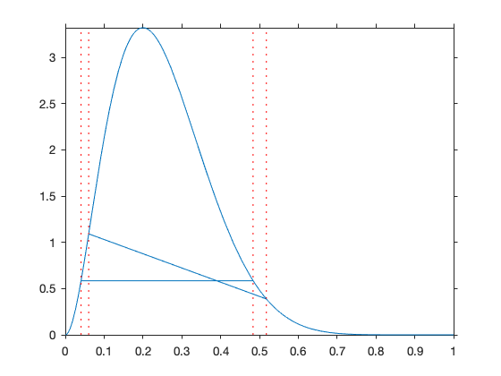


```matlab

```


```matlab
fplot(@(x) chi2pdf(x, 5), [0, 20])
hold on 
fplot(@(x) chi2pdf(x, 6), [0, 20])
```


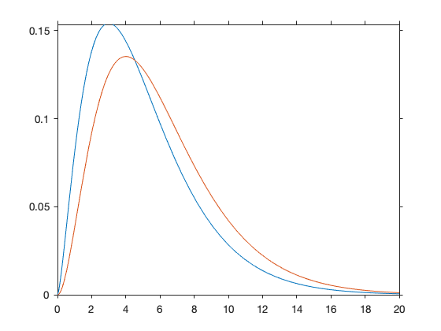


```matlab
diff(chi2inv([0.025 0.925], 25))

```

    ans =
        9.1771


```matlab
diff(chi2inv([0.025 0.925], 26))
```

    ans =
       23.1402


```matlab
mu= 0.5; sd = 2; x = normrnd(mu, sd, 1, 50 )
```

    x =
      Columns 1 through 7
        1.1375   -2.1154   -0.3672    1.1852    7.6568    6.0389   -2.1998
      Columns 8 through 14
        6.5698    1.9508    0.3739    1.9295    0.0901    0.2517    3.4794
      Columns 15 through 21
        3.3181    3.3344    1.8430   -1.9150    1.9345    3.7605    1.4778
      Columns 22 through 28
        2.5694    1.9538   -0.1069    1.0877   -1.0746    2.2768   -1.7941
      Columns 29 through 35
       -1.6377   -1.1190   -5.3886    3.3768    1.1504   -1.0099    3.2406
      Columns 36 through 42
       -2.9230    0.2955    0.0171    1.1384    1.1257   -1.2298    0.4399
      Columns 43 through 49
        0.1702    1.7554    2.6865    2.7185   -1.2273    0.6547   -1.9282
      Column 50
       -1.7270


```matlab
[h,pval,CI,stats] = ttest(x) 
```

    h =
         1
    pval =
        0.0122
    CI =
        0.2057    1.6033
    stats = 
      struct with fields:
    
        tstat: 2.6012
           df: 49
           sd: 2.4588


```matlab
help ttest

```

     TTEST  One-sample and paired-sample t-test.
        H = TTEST(X) performs a t-test of the hypothesis that the data in the
        vector X come from a distribution with mean zero, and returns the
        result of the test in H.  H=0 indicates that the null hypothesis
        ("mean is zero") cannot be rejected at the 5% significance level.  H=1
        indicates that the null hypothesis can be rejected at the 5% level.
        The data are assumed to come from a normal distribution with unknown
        variance.
     
        X can also be a matrix or an N-D array.   For matrices, TTEST performs
        separate t-tests along each column of X, and returns a vector of
        results.  For N-D arrays, TTEST works along the first non-singleton
        dimension of X.
     
        TTEST treats NaNs as missing values, and ignores them.
     
        H = TTEST(X,M) performs a t-test of the hypothesis that the data in
        X come from a distribution with mean M.  M must be a scalar.
     
        H = TTEST(X,Y) performs a paired t-test of the hypothesis that two
        matched samples, in the vectors X and Y, come from distributions with
        equal means. The difference X-Y is assumed to come from a normal
        distribution with unknown variance.  X and Y must have the same length.
        X and Y can also be matrices or N-D arrays of the same size.
     
        [H,P] = TTEST(...) returns the p-value, i.e., the probability of
        observing the given result, or one more extreme, by chance if the null
        hypothesis is true.  Small values of P cast doubt on the validity of
        the null hypothesis.
     
        [H,P,CI] = TTEST(...) returns a 100*(1-ALPHA)% confidence interval for
        the true mean of X, or of X-Y for a paired test.
     
        [H,P,CI,STATS] = TTEST(...) returns a structure with the following fields:
           'tstat' -- the value of the test statistic
           'df'    -- the degrees of freedom of the test
           'sd'    -- the estimated population standard deviation.  For a
                      paired test, this is the std. dev. of X-Y.
     
        [...] = TTEST(X,Y,'PARAM1',val1,'PARAM2',val2,...) specifies one or
        more of the following name/value pairs:
     
            Parameter       Value
            'alpha'         A value ALPHA between 0 and 1 specifying the
                            significance level as (100*ALPHA)%. Default is
                            0.05 for 5% significance.
            'dim'           Dimension DIM to work along. For example, specifying
                            'dim' as 1 tests the column means. Default is the
                            first non-singleton dimension.
            'tail'          A string specifying the alternative hypothesis:
                'both'  -- "mean is not M" (two-tailed test)
                'right' -- "mean is greater than M" (right-tailed test)
                'left'  -- "mean is less than M" (left-tailed test)
     
        See also TTEST2, ZTEST, SIGNTEST, SIGNRANK, VARTEST.
    
        Reference page in Doc Center
           doc ttest
    
    


```matlab

```
