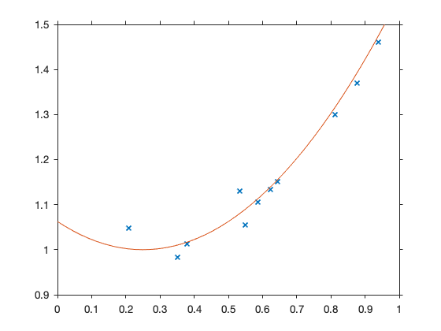
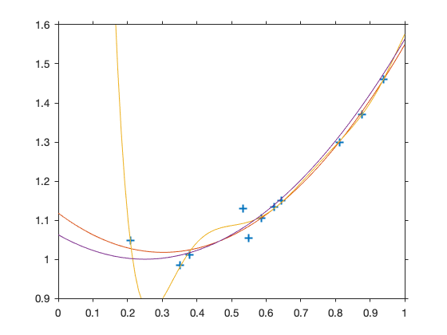
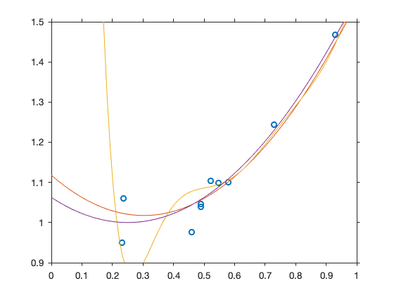
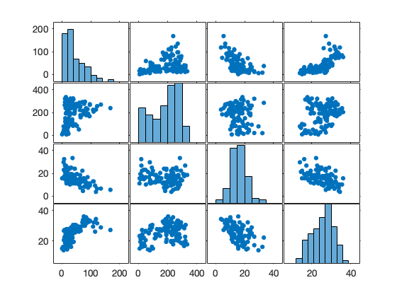

## Chapter 8. Model Selection

### Example 8.2 Overfitting

Let's generate observations fom the model

$$
Y_i = (X_i - 0.25)^2 + 1 + N(0, 0.1^2), \qquad X_i \sim U([0,1]), \qquad i = 1, \dots, 11
$$


```matlab
clear
rng= 120;
x = rand(11,1);
y = ((x - 0.25).^2 + 1) + normrnd(0, 0.03, [11,1]);
```


```matlab
plot(x,y, 'x')
xlim([0,1])
ylim([0.9,1.5])
hold on 
fplot(@(x) (x - 0.25).^2 + 1)
hold off
```





Then we fit a linear, a quadratic and a (7th degree)-polynomial model. 


```matlab
data = table(x,y)
```

    data =
      11x2 table
           x          y   
        _______    _______
        0.64432     1.1506
        0.37861     1.0122
        0.81158     1.2994
        0.53283     1.1305
        0.35073    0.98387
          0.939     1.4602
        0.87594     1.3704
        0.55016     1.0549
        0.62248      1.133
        0.58704     1.1054
        0.20774     1.0477


```matlab
m1 = fitlm(data, 'linear')
```

    m1 = 
    Linear regression model:
        y ~ 1 + x
    
    Estimated Coefficients:
                       Estimate       SE       tStat       pValue  
                       ________    ________    ______    __________
        (Intercept)     0.7915     0.057299    13.813    2.3028e-07
        x              0.62174     0.091107    6.8243    7.6918e-05
    
    Number of observations: 11, Error degrees of freedom: 9
    Root Mean Squared Error: 0.065
    R-squared: 0.838,  Adjusted R-Squared: 0.82
    F-statistic vs. constant model: 46.6, p-value = 7.69e-05


```matlab
m2 = fitlm(data, 'quadratic')
```

    m2 = 
    Linear regression model:
        y ~ 1 + x + x^2
    
    Estimated Coefficients:
                       Estimate       SE       tStat       pValue  
                       ________    ________    ______    __________
        (Intercept)      1.1179    0.054626    20.465    3.4009e-08
        x              -0.66236     0.19707    -3.361     0.0099168
        x^2              1.0933     0.16466    6.6397    0.00016254
    
    Number of observations: 11, Error degrees of freedom: 8
    Root Mean Squared Error: 0.027
    R-squared: 0.975,  Adjusted R-Squared: 0.969
    F-statistic vs. constant model: 157, p-value = 3.83e-07


```matlab
m7 = fitlm(data, 'y ~ 1 + x + x^2 + x^3 + x^4 + x^5 + x^6 + x^7')
```

    m7 = 
    Linear regression model:
        y ~ 1 + x + x^2 + x^3 + x^4 + x^5 + x^6 + x^7
    
    Estimated Coefficients:
                       Estimate      SE       tStat      pValue 
                       ________    ______    ________    _______
        (Intercept)     16.559     31.899      0.5191    0.63956
        x              -213.29     466.61    -0.45711    0.67866
        x^2             1172.3     2758.2     0.42502    0.69946
        x^3            -3391.3       8634    -0.39278    0.72072
        x^4             5629.9      15580     0.36135    0.74179
        x^5            -5395.9      16303    -0.33098    0.76243
        x^6             2778.8     9200.1     0.30204    0.78235
        x^7            -595.52     2167.7    -0.27472    0.80136
    
    Number of observations: 11, Error degrees of freedom: 3
    Root Mean Squared Error: 0.0331
    R-squared: 0.986,  Adjusted R-Squared: 0.953
    F-statistic vs. constant model: 30.1, p-value = 0.00883


```matlab
b1 = m1.Coefficients{:,1};
b2 = m2.Coefficients{:,1};
b7 = m7.Coefficients{:,1};
```


```matlab
plot(x,y, '+')
hold on 
z = linspace(0,1, 100);
%plot(z, polyval(rot90(b1'), z))
plot(z, polyval(rot90(b2'), z))
plot(z, polyval(rot90(b7'), z))
fplot(@(x) (x - 0.25).^2 + 1)
xlim([0,1])
ylim([0.9,1.6])
hold off

```





Apply the fitted data to a new data set from the same model


```matlab
xnew = rand(11,1);
ynew = ((xnew - 0.25).^2 + 1) + normrnd(0, 0.03, [11,1]);

plot(xnew,ynew, 'o')
hold on 
z = linspace(0,1, 100);
%plot(z, polyval(rot90(b1'), z))
plot(z, polyval(rot90(b2'), z))
plot(z, polyval(rot90(b7'), z))
fplot(@(x) (x - 0.25).^2 + 1)
xlim([0,1])
ylim([0.9,1.5])
hold off
```





## Model selection 

Our example is based on cement hardening data. Four predictor variables (as a percentage by weight) are used to predict the dependent variable `heat` measuring􏰸 calories of heat evolved per gram of cement after 180 days of hardening.

- `heat`: heat of hardening after 180 days (cal/gm)
- `x1` : 3CaO.Al2O3 (tricalcium aluminate)                
- `x2`: 3CaO.SiO2 (tricalcium silicate)                  
- `x3`: 4CaO.Al2O3.Fe2O3 (tetracalcium aluminoferrite)   
- `x4`: 2CaO.SiO2 (beta-dicalcium silicate)              
                                                                                       
                                                              
**Source**                                        

Woods,H., H. Steinour, H. Starke (1932). Effect of Composition of Portland Cement on Heat Evolved during Hardening, *Industrial and Engineering Chemistry*, vol. 24 no. 11, 1207-1214.                          
                                                              
**Reference**                                                
    
Hald,A. (1960). *Statistical Theory with Engineering Applications*, Wiley.


```matlab
heat = [78.5000
   74.3000
  104.3000
   87.6000
   95.9000
  109.2000
  102.7000
   72.5000
   93.1000
  115.9000
   83.8000
  113.3000
  109.4000];
```


```matlab
 x1 = [ 7     1    11    11     7    11     3     1     2    21     1    11    10 ]';
 x2 = [ 26    29    56    31    52    55    71    31    54    47    40    66    68]';
 x3 = [  6    15     8     8     6     9    17    22    18     4    23     9     8]';
 x4  =[ 60    52    20    47    33    22     6    44    22    26    34    12    12]';
```

Notice that the explanatory variables sum up approximately to 100.


```matlab
x1 + x2 + x3 + x4
```

    ans =
        99
        97
        95
        97
        98
        97
        97
        98
        96
        98
        98
        98
        98


```matlab
cement = table(heat, x1, x2, x3, x4)
```

    cement =
      13x5 table
        heat     x1    x2    x3    x4
        _____    __    __    __    __
         78.5     7    26     6    60
         74.3     1    29    15    52
        104.3    11    56     8    20
         87.6    11    31     8    47
         95.9     7    52     6    33
        109.2    11    55     9    22
        102.7     3    71    17     6
         72.5     1    31    22    44
         93.1     2    54    18    22
        115.9    21    47     4    26
         83.8     1    40    23    34
        113.3    11    66     9    12
        109.4    10    68     8    12


"What approximating model to use?" is the primary focus of this example. The sample size is quite quite small with respect to the number of variables. 

We can use several different approaches:

- Test methods
- Penalty methods (AIC, BIC) 
- Cross validation

### Test methods

**Step-up method**. Fit first a null model and then try to improve the fit by adding predictors. The criterion is the  p-value for an F-test (equivalent for single terms is the t-test). 


```matlab
m0 = fitlm(cement, 'heat ~ 1')
```

    m0 = 
    Linear regression model:
        heat ~ 1
    
    Estimated Coefficients:
                       Estimate      SE      tStat      pValue  
                       ________    ______    _____    __________
        (Intercept)     95.423     4.1724    22.87    2.8992e-11
    
    Number of observations: 13, Error degrees of freedom: 12
    Root Mean Squared Error: 15


```matlab
step(m0, 'Criterion', 'sse','NSteps', 3,  'Upper', 'linear', 'Lower', 'linear', 'Verbose', 2)
```

       pValue for adding x1 is 0.004552
       pValue for adding x2 is 0.00066482
       pValue for adding x3 is 0.059762
       pValue for adding x4 is 0.00057623
    1. Adding x4, FStat = 22.7985, pValue = 0.000576232
       pValue for adding x1 is 1.1053e-06
       pValue for adding x2 is 0.68668
       pValue for adding x3 is 8.3755e-05
    2. Adding x1, FStat = 108.2239, pValue = 1.105281e-06
       pValue for adding x2 is 0.051687
       pValue for adding x3 is 0.069692
       No candidate terms to remove
    ans = 
    Linear regression model:
        heat ~ 1 + x1 + x4
    
    Estimated Coefficients:
                       Estimate       SE        tStat       pValue  
                       ________    ________    _______    __________
        (Intercept)       103.1       2.124      48.54    3.3243e-13
        x1                 1.44     0.13842     10.403    1.1053e-06
        x4             -0.61395    0.048645    -12.621    1.8149e-07
    
    Number of observations: 13, Error degrees of freedom: 10
    Root Mean Squared Error: 2.73
    R-squared: 0.972,  Adjusted R-Squared: 0.967
    F-statistic vs. constant model: 177, p-value = 1.58e-08


The final model contains `x1` and `x4`.

**Step-down methods**. Fit the complete linear model. Then drop predictor until no further step improves the criterion. 


```matlab
mlin = fitlm(cement, 'heat ~ 1 + x1 + x2 + x3 + x4')
```

    mlin = 
    Linear regression model:
        heat ~ 1 + x1 + x2 + x3 + x4
    
    Estimated Coefficients:
                       Estimate      SE        tStat       pValue 
                       ________    _______    ________    ________
        (Intercept)      62.405     70.071      0.8906     0.39913
        x1               1.5511    0.74477      2.0827    0.070822
        x2              0.51017    0.72379     0.70486      0.5009
        x3              0.10191    0.75471     0.13503     0.89592
        x4             -0.14406    0.70905    -0.20317     0.84407
    
    Number of observations: 13, Error degrees of freedom: 8
    Root Mean Squared Error: 2.45
    R-squared: 0.982,  Adjusted R-Squared: 0.974
    F-statistic vs. constant model: 111, p-value = 4.76e-07


```matlab
step(mlin, 'Criterion', 'sse','NSteps', 3,  'Upper', 'constant', 'Lower', 'constant', 'Verbose', 2)
```

       No candidate terms to add
       pValue for removing x1 is 0.070822
       pValue for removing x2 is 0.5009
       pValue for removing x3 is 0.89592
       pValue for removing x4 is 0.84407
    1. Removing x3, FStat = 0.018233, pValue = 0.89592
       No candidate terms to add
       pValue for removing x1 is 5.7808e-07
       pValue for removing x2 is 0.051687
       pValue for removing x4 is 0.2054
    2. Removing x4, FStat = 1.8633, pValue = 0.2054
       No candidate terms to add
       pValue for removing x1 is 2.6922e-07
       pValue for removing x2 is 5.029e-08
    ans = 
    Linear regression model:
        heat ~ 1 + x1 + x2
    
    Estimated Coefficients:
                       Estimate       SE       tStat       pValue  
                       ________    ________    ______    __________
        (Intercept)     52.577       2.2862    22.998    5.4566e-10
        x1              1.4683       0.1213    12.105    2.6922e-07
        x2             0.66225     0.045855    14.442     5.029e-08
    
    Number of observations: 13, Error degrees of freedom: 10
    Root Mean Squared Error: 2.41
    R-squared: 0.979,  Adjusted R-Squared: 0.974
    F-statistic vs. constant model: 230, p-value = 4.41e-09


This time the chosen model contains `x1` and `x2`.  

We can alternate the step-up and step-down procedures. 


```matlab
step(m0, 'Criterion', 'sse','NSteps', 3,  'Upper', 'linear', 'Lower', 'constant', 'Verbose', 2)
```

       pValue for adding x1 is 0.004552
       pValue for adding x2 is 0.00066482
       pValue for adding x3 is 0.059762
       pValue for adding x4 is 0.00057623
    1. Adding x4, FStat = 22.7985, pValue = 0.000576232
       pValue for adding x1 is 1.1053e-06
       pValue for adding x2 is 0.68668
       pValue for adding x3 is 8.3755e-05
    2. Adding x1, FStat = 108.2239, pValue = 1.105281e-06
       pValue for adding x2 is 0.051687
       pValue for adding x3 is 0.069692
       pValue for removing x4 is 1.8149e-07
    ans = 
    Linear regression model:
        heat ~ 1 + x1 + x4
    
    Estimated Coefficients:
                       Estimate       SE        tStat       pValue  
                       ________    ________    _______    __________
        (Intercept)       103.1       2.124      48.54    3.3243e-13
        x1                 1.44     0.13842     10.403    1.1053e-06
        x4             -0.61395    0.048645    -12.621    1.8149e-07
    
    Number of observations: 13, Error degrees of freedom: 10
    Root Mean Squared Error: 2.73
    R-squared: 0.972,  Adjusted R-Squared: 0.967
    F-statistic vs. constant model: 177, p-value = 1.58e-08


### Penalty methods

We can use AIC or BIC (Bayesian). These methods aim at selecting models that are better for prediction. They can be used with the step-up or step-down strategies. 

Add predictors until no further step improves the AIC


```matlab
step(m0, 'Criterion', 'AIC','NSteps', 3,  'Upper', 'linear', 'Lower', 'linear', 'Verbose', 2)
```

       Change in AIC for adding x1 is -7.925
       Change in AIC for adding x2 is -12.2664
       Change in AIC for adding x3 is -2.377
       Change in AIC for adding x4 is -12.5928
    1. Adding x4, AIC = 95.744
       Change in AIC for adding x1 is -30.1099
       Change in AIC for adding x2 is 1.7777
       Change in AIC for adding x3 is -18.9991
    2. Adding x1, AIC = 65.6341
       Change in AIC for adding x2 is -3.7678
       Change in AIC for adding x3 is -3.0142
    3. Adding x2, AIC = 61.8663
    ans = 
    Linear regression model:
        heat ~ 1 + x1 + x2 + x4
    
    Estimated Coefficients:
                       Estimate      SE       tStat       pValue  
                       ________    _______    ______    __________
        (Intercept)      71.648     14.142    5.0662    0.00067533
        x1               1.4519      0.117     12.41    5.7808e-07
        x2              0.41611    0.18561    2.2418      0.051687
        x4             -0.23654    0.17329    -1.365        0.2054
    
    Number of observations: 13, Error degrees of freedom: 9
    Root Mean Squared Error: 2.31
    R-squared: 0.982,  Adjusted R-Squared: 0.976
    F-statistic vs. constant model: 167, p-value = 3.32e-08


Fit the complete linear model. Then drop predictor until no further step improves the AIC.


```matlab
step(mlin, 'Criterion', 'AIC','NSteps', 3,  'Upper', 'linear', 'Lower', 'constant', 'Verbose', 2)
```

       No candidate terms to add
       Change in AIC for removing x1 is 3.6316
       Change in AIC for removing x2 is -1.2167
       Change in AIC for removing x3 is -1.9704
       Change in AIC for removing x4 is -1.9331
    1. Removing x3, AIC = 61.866
       No candidate terms to add
       Change in AIC for removing x1 is 35.6554
       Change in AIC for removing x2 is 3.7678
       Change in AIC for removing x4 is 0.44611
    ans = 
    Linear regression model:
        heat ~ 1 + x1 + x2 + x4
    
    Estimated Coefficients:
                       Estimate      SE       tStat       pValue  
                       ________    _______    ______    __________
        (Intercept)      71.648     14.142    5.0662    0.00067533
        x1               1.4519      0.117     12.41    5.7808e-07
        x2              0.41611    0.18561    2.2418      0.051687
        x4             -0.23654    0.17329    -1.365        0.2054
    
    Number of observations: 13, Error degrees of freedom: 9
    Root Mean Squared Error: 2.31
    R-squared: 0.982,  Adjusted R-Squared: 0.976
    F-statistic vs. constant model: 167, p-value = 3.32e-08


AIC promotes the use of the variable `x4` in both strategies. 

Next we use BIC.


```matlab
step(m0, 'Criterion', 'BIC','NSteps', 3,  'Upper', 'linear', 'Lower', 'linear', 'Verbose', 2)
```

       Change in BIC for adding x1 is -7.36
       Change in BIC for adding x2 is -11.7015
       Change in BIC for adding x3 is -1.8121
       Change in BIC for adding x4 is -12.0278
    1. Adding x4, BIC = 96.8739
       Change in BIC for adding x1 is -29.545
       Change in BIC for adding x2 is 2.3426
       Change in BIC for adding x3 is -18.4341
    2. Adding x1, BIC = 67.329
       Change in BIC for adding x2 is -3.2029
       Change in BIC for adding x3 is -2.4492
    3. Adding x2, BIC = 64.1261
    ans = 
    Linear regression model:
        heat ~ 1 + x1 + x2 + x4
    
    Estimated Coefficients:
                       Estimate      SE       tStat       pValue  
                       ________    _______    ______    __________
        (Intercept)      71.648     14.142    5.0662    0.00067533
        x1               1.4519      0.117     12.41    5.7808e-07
        x2              0.41611    0.18561    2.2418      0.051687
        x4             -0.23654    0.17329    -1.365        0.2054
    
    Number of observations: 13, Error degrees of freedom: 9
    Root Mean Squared Error: 2.31
    R-squared: 0.982,  Adjusted R-Squared: 0.976
    F-statistic vs. constant model: 167, p-value = 3.32e-08


```matlab
step(mlin, 'Criterion', 'BIC','NSteps', 3,  'Upper', 'linear', 'Lower', 'constant', 'Verbose', 2)
```

       No candidate terms to add
       Change in BIC for removing x1 is 3.0666
       Change in BIC for removing x2 is -1.7817
       Change in BIC for removing x3 is -2.5354
       Change in BIC for removing x4 is -2.498
    1. Removing x3, BIC = 64.126
       No candidate terms to add
       Change in BIC for removing x1 is 35.0905
       Change in BIC for removing x2 is 3.2029
       Change in BIC for removing x4 is -0.11884
    2. Removing x4, BIC = 64.007
       Change in BIC for adding x3 is 0.15615
       Change in BIC for removing x1 is 33.1931
       Change in BIC for removing x2 is 37.5345
    ans = 
    Linear regression model:
        heat ~ 1 + x1 + x2
    
    Estimated Coefficients:
                       Estimate       SE       tStat       pValue  
                       ________    ________    ______    __________
        (Intercept)     52.577       2.2862    22.998    5.4566e-10
        x1              1.4683       0.1213    12.105    2.6922e-07
        x2             0.66225     0.045855    14.442     5.029e-08
    
    Number of observations: 13, Error degrees of freedom: 10
    Root Mean Squared Error: 2.41
    R-squared: 0.979,  Adjusted R-Squared: 0.974
    F-statistic vs. constant model: 230, p-value = 4.41e-09


In the step-down strategy BIC gives as the result the same predictors `x1`, `x2` of the test methods.

**Note**:  "The importance of carefully defining a small set of candidate models, based on the objective and what is known about the problem, cannot be overemphasized." (Burnham and Anderson, 2002).

### Air Pollution

From the Bijma et al. (2016, p. 325) book: "In New York, in the summer of 1973, daily measurements were carried out to study the relation between the ozone concentration and a number of other meteorological variables. In addition to the ozone concentration, the solar radiation, the wind speed, and the temperature were measured. Ozone is an important component of smog. It forms from nitrogen dioxides and volatile hydrocarbons under the influence of sunlight. In warm weather with little wind, the ozone concentration can rise sharply and cause respiratory problems."

The data set is the following one.


```matlab
X = [ 41 190 11.9066 19.4444444444444 5 1
 36 118 12.872 22.2222222222222 5 2
 12 149 20.2734 23.3333333333333 5 3
 18 313 18.5035 16.6666666666667 5 4
 23 299 13.8374 18.3333333333333 5 7
 19 99 22.2042 15 5 8
 8 19 32.3409 16.1111111111111 5 9
16 256 15.6073 20.5555555555556 5 12
11 290 14.8028 18.8888888888889 5 13
14 274 17.5381 20 5 14
18 65 21.2388 14.4444444444444 5 15
14 334 18.5035 17.7777777777778 5 16
34 307 19.308 18.8888888888889 5 17
6 78 29.6056 13.8888888888889 5 18
30 322 18.5035 20 5 19
11 44 15.6073 16.6666666666667 5 20
1 8 15.6073 15 5 21
11 320 26.7094 22.7777777777778 5 22
4 25 15.6073 16.1111111111111 5 23
32 92 19.308 16.1111111111111 5 24
23 13 19.308 19.4444444444444 5 28
45 252 23.9741 27.2222222222222 5 29
115 223 9.1713 26.1111111111111 5 30
37 279 11.9066 24.4444444444444 5 31
29 127 15.6073 27.7777777777778 6 7
71 291 22.2042 32.2222222222222 6 9
39 323 18.5035 30.5555555555556 6 10
23 148 12.872 27.7777777777778 6 13
21 191 23.9741 25 6 16
37 284 33.3063 22.2222222222222 6 17
20 37 14.8028 18.3333333333333 6 18
12 120 18.5035 22.7777777777778 6 19
13 137 16.5727 24.4444444444444 6 20
135 269 6.5969 28.8888888888889 7 1
49 248 14.8028 29.4444444444444 7 2
32 236 14.8028 27.2222222222222 7 3
64 175 7.4014 28.3333333333333 7 5
40 314 17.5381 28.3333333333333 7 6
77 276 8.2059 31.1111111111111 7 7
97 267 10.1367 33.3333333333333 7 8
97 272 9.1713 33.3333333333333 7 9
85 175 11.9066 31.6666666666667 7 10
10 264 23.0087 22.7777777777778 7 12
27 175 23.9741 27.2222222222222 7 13
7 48 23.0087 26.6666666666667 7 15
48 260 11.1021 27.2222222222222 7 16
35 274 16.5727 27.7777777777778 7 17
61 285 10.1367 28.8888888888889 7 18
79 187 8.2059 30.5555555555556 7 19
63 220 18.5035 29.4444444444444 7 20
16 7 11.1021 23.3333333333333 7 21
80 294 13.8374 30 7 24
108 223 12.872 29.4444444444444 7 25
20 81 13.8374 27.7777777777778 7 26
52 82 19.308 30 7 27
82 213 11.9066 31.1111111111111 7 28
50 275 11.9066 30 7 29
64 253 11.9066 28.3333333333333 7 30
59 254 14.8028 27.2222222222222 7 31
39 83 11.1021 27.2222222222222 8 1
9 24 22.2042 27.2222222222222 8 2
16 77 11.9066 27.7777777777778 8 3
122 255 6.436 31.6666666666667 8 7
 89 229 16.5727 32.2222222222222 8 8
 110 207 12.872 32.2222222222222 8 9
 44 192 18.5035 30 8 12
 28 273 18.5035 27.7777777777778 8 13
 65 157 15.6073 26.6666666666667 8 14
 22 71 16.5727 25 8 16
 59 51 10.1367 26.1111111111111 8 17
 23 115 11.9066 24.4444444444444 8 18
 31 244 17.5381 25.5555555555556 8 19
 44 190 16.5727 25.5555555555556 8 20
 21 259 24.9395 25 8 21
 9 36 23.0087 22.2222222222222 8 22
 45 212 15.6073 26.1111111111111 8 24
 168 238 5.4706 27.2222222222222 8 25
 73 215 12.872 30 8 26
 76 203 15.6073 36.1111111111111 8 28
 118 225 3.7007 34.4444444444444 8 29
 84 237 10.1367 35.5555555555556 8 30
 85 188 10.1367 34.4444444444444 8 31
 96 167 11.1021 32.7777777777778 9 1
 78 197 8.2059 33.3333333333333 9 2
 73 183 4.5052 33.8888888888889 9 3
 91 189 7.4014 33.8888888888889 9 4
 47 95 11.9066 30.5555555555556 9 5
 32 92 24.9395 28.8888888888889 9 6
 20 252 17.5381 26.6666666666667 9 7
 23 220 16.5727 25.5555555555556 9 8
 21 230 17.5381 23.8888888888889 9 9
 24 259 15.6073 22.7777777777778 9 10
 44 236 23.9741 27.2222222222222 9 11
 21 259 24.9395 24.4444444444444 9 12
 28 238 10.1367 25 9 13
 9 24 17.5381 21.6666666666667 9 14
 13 112 18.5035 21.6666666666667 9 15
 46 237 11.1021 25.5555555555556 9 16
 18 224 22.2042 19.4444444444444 9 17
 13 27 16.5727 24.4444444444444 9 18
 24 238 16.5727 20 9 19
 16 201 12.872 27.7777777777778 9 20
 13 238 20.2734 17.7777777777778 9 21
 23 14 14.8028 21.6666666666667 9 22
 36 139 16.5727 27.2222222222222 9 23
 7 49 16.5727 20.5555555555556 9 24
 14 20 26.7094 17.2222222222222 9 25
 30 193 11.1021 21.1111111111111 9 26
 14 191 23.0087 23.8888888888889 9 28
 18 131 12.872 24.4444444444444 9 29
 20 223 18.5035 20 9 30];
```


```matlab
ozone = X(:,1);   solar = X(:,2);  wind = X(:,3); temp = X(:,4); 
```

Variables: 
- `ozone` concentration measured in parts per billion (ppb); 1 ppb corre- sponds to 2 µ g /m3. 
- `solar` radiation (langley, Ly). It expresses the amount of solar energy per surface unit, 1 Ly = 41840 J / m2. 
- `wind` speed km/h
- `temp` temperature in degrees Celsius


```matlab
data = table(ozone, solar, wind, temp);
```


```matlab
data
```

    data =
      111x4 table
        ozone    solar     wind      temp 
        _____    _____    ______    ______
          41      190     11.907    19.444
          36      118     12.872    22.222
          12      149     20.273    23.333
          18      313     18.503    16.667
          23      299     13.837    18.333
          19       99     22.204        15
           8       19     32.341    16.111
          16      256     15.607    20.556
          11      290     14.803    18.889
          14      274     17.538        20
          18       65     21.239    14.444
          14      334     18.503    17.778
          34      307     19.308    18.889
           6       78     29.606    13.889
          30      322     18.503        20
          11       44     15.607    16.667
           1        8     15.607        15
          11      320     26.709    22.778
           4       25     15.607    16.111
          32       92     19.308    16.111
          23       13     19.308    19.444
          45      252     23.974    27.222
         115      223     9.1713    26.111
          37      279     11.907    24.444
          29      127     15.607    27.778
          71      291     22.204    32.222
          39      323     18.503    30.556
          23      148     12.872    27.778
          21      191     23.974        25
          37      284     33.306    22.222
          20       37     14.803    18.333
          12      120     18.503    22.778
          13      137     16.573    24.444
         135      269     6.5969    28.889
          49      248     14.803    29.444
          32      236     14.803    27.222
          64      175     7.4014    28.333
          40      314     17.538    28.333
          77      276     8.2059    31.111
          97      267     10.137    33.333
          97      272     9.1713    33.333
          85      175     11.907    31.667
          10      264     23.009    22.778
          27      175     23.974    27.222
           7       48     23.009    26.667
          48      260     11.102    27.222
          35      274     16.573    27.778
          61      285     10.137    28.889
          79      187     8.2059    30.556
          63      220     18.503    29.444
          16        7     11.102    23.333
          80      294     13.837        30
         108      223     12.872    29.444
          20       81     13.837    27.778
          52       82     19.308        30
          82      213     11.907    31.111
          50      275     11.907        30
          64      253     11.907    28.333
          59      254     14.803    27.222
          39       83     11.102    27.222
           9       24     22.204    27.222
          16       77     11.907    27.778
         122      255      6.436    31.667
          89      229     16.573    32.222
         110      207     12.872    32.222
          44      192     18.503        30
          28      273     18.503    27.778
          65      157     15.607    26.667
          22       71     16.573        25
          59       51     10.137    26.111
          23      115     11.907    24.444
          31      244     17.538    25.556
          44      190     16.573    25.556
          21      259     24.939        25
           9       36     23.009    22.222
          45      212     15.607    26.111
         168      238     5.4706    27.222
          73      215     12.872        30
          76      203     15.607    36.111
         118      225     3.7007    34.444
          84      237     10.137    35.556
          85      188     10.137    34.444
          96      167     11.102    32.778
          78      197     8.2059    33.333
          73      183     4.5052    33.889
          91      189     7.4014    33.889
          47       95     11.907    30.556
          32       92     24.939    28.889
          20      252     17.538    26.667
          23      220     16.573    25.556
          21      230     17.538    23.889
          24      259     15.607    22.778
          44      236     23.974    27.222
          21      259     24.939    24.444
          28      238     10.137        25
           9       24     17.538    21.667
          13      112     18.503    21.667
          46      237     11.102    25.556
          18      224     22.204    19.444
          13       27     16.573    24.444
          24      238     16.573        20
          16      201     12.872    27.778
          13      238     20.273    17.778
          23       14     14.803    21.667
          36      139     16.573    27.222
           7       49     16.573    20.556
          14       20     26.709    17.222
          30      193     11.102    21.111
          14      191     23.009    23.889
          18      131     12.872    24.444
          20      223     18.503        20


```matlab
plotmatrix(table2array(data))
```





We fit a linear additive model 
$$
Y = \beta_0 + \beta_1 \texttt{solar} + \beta_2 \texttt{wind} + \beta_3 \texttt{temp} + e
$$


```matlab
mlin = fitlm(data, 'ozone ~ solar + wind + temp')
```

    mlin = 
    Linear regression model:
        ozone ~ 1 + solar + wind + temp
    
    Estimated Coefficients:
                       Estimate       SE        tStat        pValue  
                       ________    ________    ________    __________
        (Intercept)     -11.475      15.646    -0.73344       0.46489
        solar          0.059821    0.023186        2.58      0.011237
        wind            -2.0718     0.40672     -5.0941    1.5159e-06
        temp             2.9738     0.45635      6.5164    2.4235e-09
    
    Number of observations: 111, Error degrees of freedom: 107
    Root Mean Squared Error: 21.2
    R-squared: 0.606,  Adjusted R-Squared: 0.595
    F-statistic vs. constant model: 54.8, p-value = 1.51e-21


Then we do  model selection including possibly also interactions.


```matlab
out = step(mlin, 'Criterion', 'AIC','NSteps', 3,  'Upper', 'interactions', 'Lower', 'constant', 'Verbose', 2)
```

       Change in AIC for adding solar:wind is -8.9758
       Change in AIC for adding solar:temp is -10.2823
       Change in AIC for adding wind:temp is -16.1119
    1. Adding wind:temp, AIC = 980.6052
       Change in AIC for adding solar:wind is -0.74421
       Change in AIC for adding solar:temp is -3.987
    2. Adding solar:temp, AIC = 976.6182
       Change in AIC for adding solar:wind is 0.75935
       Change in AIC for removing wind:temp is 9.8166
    out = 
    Linear regression model:
        ozone ~ 1 + solar*temp + wind*temp
    
    Estimated Coefficients:
                       Estimate       SE         tStat       pValue  
                       ________    _________    _______    __________
        (Intercept)     -58.368       38.055    -1.5338       0.12809
        solar          -0.17011      0.10012    -1.6992       0.09225
        wind             3.2212       1.5856     2.0315      0.044725
        temp             4.4124       1.4851     2.9712     0.0036777
        solar:temp     0.010291    0.0042662     2.4122      0.017589
        wind:temp      -0.20844     0.060693    -3.4343    0.00085159
    
    Number of observations: 111, Error degrees of freedom: 105
    Root Mean Squared Error: 19.2
    R-squared: 0.683,  Adjusted R-Squared: 0.668
    F-statistic vs. constant model: 45.2, p-value = 1.12e-24


```matlab
out2 = step(mlin, 'Criterion', 'AIC','NSteps', 3,  'Upper', 'quadratic', 'Lower', 'constant', 'Verbose', 2)
```

       Change in AIC for adding solar:wind is -8.9758
       Change in AIC for adding solar:temp is -10.2823
       Change in AIC for adding wind:temp is -16.1119
       Change in AIC for adding solar^2 is 1.8762
       Change in AIC for adding wind^2 is -24.5362
       Change in AIC for adding temp^2 is -12.58
    1. Adding wind^2, AIC = 972.1809
       Change in AIC for adding solar:wind is -3.4382
       Change in AIC for adding solar:temp is -6.2016
       Change in AIC for adding wind:temp is 1.0573
       Change in AIC for adding solar^2 is 1.6907
       Change in AIC for adding temp^2 is -6.3985
    2. Adding temp^2, AIC = 965.7824
       Change in AIC for adding solar:wind is -1.0462
       Change in AIC for adding solar:temp is -1.554
       Change in AIC for adding wind:temp is 0.78545
       Change in AIC for adding solar^2 is 1.3158
    3. Adding solar:temp, AIC = 964.2285
    out2 = 
    Linear regression model:
        ozone ~ 1 + wind + solar*temp + wind^2 + temp^2
    
    Estimated Coefficients:
                       Estimate       SE         tStat       pValue  
                       ________    _________    _______    __________
        (Intercept)      143.02       34.328     4.1664    6.4102e-05
        solar          -0.11467      0.10017    -1.1448       0.25493
        wind             -8.098       1.4204    -5.7013    1.1213e-07
        temp            -4.6201       2.8728    -1.6082       0.11082
        solar:temp     0.007844    0.0042642     1.8395      0.068696
        wind^2           0.1722     0.038712     4.4481    2.1776e-05
        temp^2          0.11807     0.062452     1.8906      0.061461
    
    Number of observations: 111, Error degrees of freedom: 104
    Root Mean Squared Error: 18.1
    R-squared: 0.721,  Adjusted R-Squared: 0.705
    F-statistic vs. constant model: 44.9, p-value = 1.05e-26


```matlab

```

### Cross-validation

I don't now yet if CV is needed.


```matlab

```


```matlab

```


```matlab


```


```matlab

```
